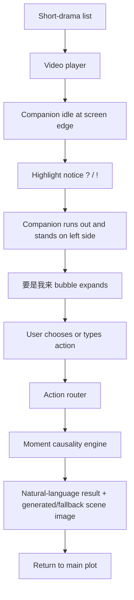
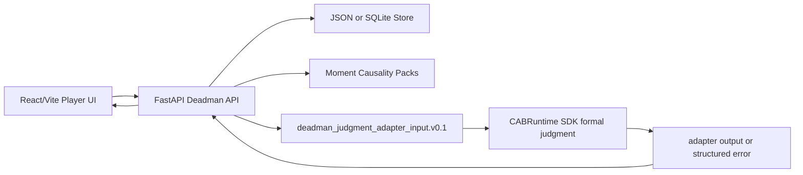

# 要是我来 PRD v0.2

> Branch: OSeria Branch 3  
> External name: 要是我来  
> Internal codename: Deadman  
> English working name: If It Was Up To Me  
> Date: 2026-05-23  
> Target: Byte AI full-stack short-drama challenge, final delivery by 2026-06-11  
> Status: product-definition draft, companion-first UX locked

## 0. One-Line Definition

「要是我来」是一个短剧高光点剧情介入判定系统，让观众在最想吐槽、反击、改写的一刻，验证自己的选择会带来什么可信后果。

It is not a long-form RP client, not a generic SillyTavern clone, and not a real-time AI video generator. It is a player-first short-drama interaction layer backed by a moment-level social causality engine.

## 1. Background

The organizer task is "short-drama instant interaction triggered by plot understanding." The required product shape is a client-server loop around short-drama playback:

- show drama list;
- play short drama;
- mark and deliver highlight moments;
- render interaction at the right timestamp;
- provide backend service and storage;
- optionally use models to understand and generate around short-drama moments.

Our earlier OSeria / ArcForge direction focused on entering an IP world and continuing a story. That is adjacent but too heavy for this task. The competition asks for an interaction layer inside the watching flow, not a standalone RP world.

Therefore Branch 3 should be separated from ArcForge:

| Branch | Core job | Primary pack |
|---|---|---|
| OSeria | self-created world / RP runtime | World Blueprint |
| ArcForge | long-video IP to playable world | World Pack |
| 要是我来 | short-drama highlight intervention | Moment Causality Pack |

## 2. User Insight

The target user is a short-drama viewer at a high-emotion moment.

Typical inner monologue:

- "要是我在这肯定不这么干。"
- "要我是主角，我直接反击。"
- "这个男主太蠢了，我来选。"
- "她现在不该忍，应该先录音取证。"

This is not just comment desire. It is a counterfactual intervention impulse: the user wants the world to acknowledge their judgment.

The first-principles emotional goal:

```text
Make the viewer believe:
"If I chose this, the story world would plausibly react this way."
```

The product value is the meta pleasure:

- I understood the situation.
- I saw a better move than the protagonist.
- The system recognized my move.
- The result felt consistent with character, plot, and world rules.

## 3. Product Goal

P0 goal:

```text
Turn one short-drama highlight point into a believable interactive consequence.
```

The user should be able to:

1. open a short-drama list;
2. enter a player page;
3. watch until a highlight moment;
4. see an interaction prompt;
5. choose A/B/C or type a custom action;
6. receive a natural-language consequence result with social causality, generated or fallback scene image, and compact evidence of judgment;
7. return to the main video flow.

Success is not measured by generating long alternate plots. Success is measured by whether the user thinks:

```text
这个判定像真的。
我这样选确实会这样。
甚至我这步比原剧情更聪明。
```

## 4. Non-Goals

P0 explicitly does not attempt:

- real-time AI video generation as the blocking interaction path;
- voice input or voice output;
- full long-term roleplay;
- full multi-character autonomous simulation;
- full ArcForge World Fact Runtime;
- full material ingestion from arbitrary drama videos;
- multi-user real-time networking;
- native Android/iOS unless the team later decides it is necessary.

AI video can be an async enhancement or future visual layer, but P0 should not depend on it.

All voice capability belongs to P1. The P0 UI should still use native text inputs so external system input methods, including Doubao IME or OS dictation, can enter text normally.

## 5. Core Product Loop



## 5.1 Final Submission Shape

Competition requirement allows Android / iOS / HarmonyOS frontend for team submissions. For solo participation, Web frontend + backend is explicitly allowed. Therefore our selected delivery track is:

```text
Solo track: mobile-first Web frontend + FastAPI backend.
```

The final product should be an H5/PWA-style web app rendered in a phone-shaped vertical player. It satisfies the short-drama app expectation while keeping deployment, recording, and iteration faster. We should not spend P0 time on native Android/iOS/Harmony unless Web delivery becomes blocked.

Platform decision:

- P0 committed delivery: mobile-first Web frontend + FastAPI backend.
- Optional stretch: Android APK wrapper around the same Web frontend if core functionality is complete early.
- Explicit non-target: iOS installable IPA / TestFlight delivery for this sprint, because distribution and signing create avoidable schedule risk.
- Frontend product shape is mobile-first from day one. Desktop is only a phone-preview shell for development, judging, and recording.

Submission package:

- GitHub repository with backend, frontend, seed data, and setup instructions;
- Git-managed branches and clear commit history;
- browser-accessible demo URL, or a clearly runnable local demo if deployment is blocked;
- demo recording showing the end-to-end user loop;
- final runnable artifact;
- technical document covering module split, technical choices, main flowchart, work breakdown, schedule, and AI usage disclosure;
- local evidence artifacts for the bridge process: ARS node mining notes, selected timestamps, generated Moment Causality Packs, and transcript/keyframe provenance.

### User-Side Surface

This is the primary product surface and the main thing judges should see.

Required shape:

- simulated short-drama app entry / catalog;
- vertical short-drama player;
- normal playback with play/pause, progress, timestamp, and highlight marker;
- companion half-hidden at the lower-left edge;
- at selected timestamps, companion shows `?` / `!`;
- on tap, companion runs out and opens a half-page / bubble-style "要是我来" UI;
- user selects A/B/C or types a custom action;
- backend returns companion verdict, consequence prose, image/fallback card, compact evidence, and aggregate choice stats;
- user closes the bubble and returns to watching.

### Mobile-First UI Contract

This project must not repeat the Roco-style failure mode where a technically working mobile surface passes typecheck and preserves runtime boundaries, but fails product acceptance because the accepted visual / interaction source of truth, asset fidelity, copy, and mobile layout hierarchy were not enforced early enough. The Web implementation is a mobile product surface, not a desktop product with responsive shrinkage.

Hard constraints:

- design and implement against phone portrait viewports first: `390x844`, `393x852`, and `430x932`;
- primary app surface is a 9:16 vertical short-drama player;
- desktop viewport shows a centered phone preview shell, not a stretched desktop layout;
- all primary touch targets are at least `44px`;
- companion, notice marker, bubble panel, close button, and input submit must sit inside mobile safe areas;
- support `env(safe-area-inset-*)` for future Android/iOS WebView wrappers;
- use native `button`, `input`, and `textarea` elements for mobile keyboard, accessibility, and system voice-input compatibility;
- avoid hover-only interaction, dense desktop tables, sidebars, and mouse-dependent controls on the user-side surface;
- result bubble and producer/debug UI must not block subtitles, playback controls, or the companion return path;
- every P0 user flow must be verified at mobile widths before it is considered done.

Desktop-specific affordances are allowed only around the phone shell, for example recording controls or debug links outside the simulated device. They must not be required for the user-side product flow.

### Producer-Side / Bridge Surface

This should exist as an internal authoring/debug surface, not as the main consumer product.

P0 producer surface can be thin:

- import or register downloaded organizer episodes;
- show media index, transcripts/OCR/keyframe windows, and candidate intervention nodes;
- rank nodes by interaction value;
- open a candidate node and inspect its source window;
- draft / edit Moment Causality Pack fields;
- mark selected nodes as published to the user-side player.

Do not overbuild this into a complete creator platform for P0. Its job is to prove that raw short-drama material can be bridged into runtime-ready interactive moments. The user-side demo proves product value; the producer-side surface proves technical depth and repeatability.

## 6. MVP Feature Set

### 6.0 Demo Material Strategy

P0 should prove the engine in two stages:

| Stage | Genre target | Candidate organizer drama | Purpose |
|---|---|---|---|
| Foundation | apocalypse / system / survival with family conflict | `荒年全村啃树皮，我有系统满仓肉` | Build the engine around concrete resources, risk, system limits, and emotionally hot "how would you survive this" choices. |
| Migration validation | revenge / humiliation / relationship conflict | `幸得相遇离婚时` or `撕夜` | Test the higher-s爽感 "I would not take this" social-revenge loop after the base engine works. |
| Migration validation | cultivation / summon / supernatural | `云渺1：我修仙多年强亿点怎么了` | Test whether the pack can enforce special genre rules and power boundaries. |

The first demo should prioritize a resource crisis with visible emotional pressure: starving family, village scarcity, pushy relatives, moral pressure to share, or the risk of exposing the system. This genre is less instantly "打脸" than divorce revenge, but it is better for validating the engine because every choice has concrete cost: food, safety, trust, exposure, and future leverage.

### 6.1 Short-Drama Catalog

Purpose: satisfy the mandatory list-entry requirement.

MVP:

- drama list page;
- title, poster, genre, current episode count;
- entry button into the demo episode;
- one allowed organizer drama selected as the demo target.

### 6.2 Player Page

Purpose: make the product visibly match the competition task.

MVP:

- video player shell;
- play/pause;
- progress bar;
- current timestamp;
- highlight moment marker on timeline;
- fallback mock video or local placeholder if final material is not yet downloaded.

### 6.3 Highlight Moment Trigger

Purpose: connect content understanding to interaction.

MVP:

- store highlight moments in seed data;
- each moment has timestamp, type, hook copy, options, and pack reference;
- trigger companion notice when playback reaches the moment.

Moment types:

- conflict;
- reversal;
- famous scene;
- sweet moment;
- humiliation / revenge setup;
- resource crisis;
- reveal / hidden identity.

### 6.4 Companion Trigger Layer

Purpose: make the interaction feel like a watching companion noticing the same emotional beat as the viewer, instead of a generic product pop-up.

This is the primary P0 entry. The player remains the main surface; the companion is a low-interference trigger and result narrator.

States:

| State | Behavior | Product consequence |
|---|---|---|
| `idle` | Companion is half-exposed from the left screen edge, similar to the user sketch. No text. Small idle motion is allowed. | Viewer feels presence without losing the drama frame. |
| `notice` | At a marked highlight moment, a compact `?` or `!` appears above the companion. No large panel yet. | The viewer sees an opportunity to intervene without forced interruption. |
| `invite` | On tap, companion runs/slides out and stands at the left side of the video frame. | The interaction feels diegetic and lightweight, not like an ad modal. |
| `bubble` | The "要是我来" interface opens as the companion's chat bubble. | The product inherits chat affordance without becoming full chat. |
| `judge` | Bubble shows a short thinking state after user action. | The system communicates that it is judging causality, not loading a branch page. |
| `verdict` | Bubble/result panel shows consequence prose, generated/fallback image, and compact judgment evidence. | Viewer gets the meta pleasure: "my move was evaluated." |
| `dismissed` | Companion returns to the half-hidden idle position and playback continues. | Single-shot interaction avoids long branch derailment. |

Layout requirements:

- default position: left edge, lower-middle safe area;
- idle visible area: only part of the avatar/body should show, enough to imply presence;
- notice marker: `?` or `!`, small, above avatar, never covering face/subtitles/key drama action;
- invite position: companion stands on left side after running out;
- bubble direction: bubble expands from companion toward the center/right;
- playback controls and subtitles remain readable;
- close/continue action is always available.

P0 implementation should use static transparent PNG/WebP assets plus CSS transitions. Live2D, full avatar engine, voice input, voice output, and free chat are not P0 requirements. The core interaction must remain text-first and fully usable without audio.

V1 visual direction:

- character: a semi-pixel tomato-hood girl in an oversized full-length red sleeping robe;
- silhouette: tomato hood with green leaf tuft, sleepy/sharp expression, long robe hem dragging on the floor;
- tone: watching companion, mildly mischievous, sharp enough to judge the plot, not idol-like or mascot-only cute;
- style: chunky pixel-adjacent sticker art with thick outline, readable at small mobile-overlay size;
- key states:
  - `idle`: half-hidden on the left edge;
  - `notice_question`: half-hidden on the left edge with `?`;
  - `notice_exclaim`: half-hidden on the left edge with `!`;
  - `runout`: slides/runs out, robe hem trailing;
  - `stand_bubble`: stands on the left with the "要是我来" bubble;
  - `thinking`: small judgment/loading motion;
  - `verdict`: holds a placard; current exported asset keeps the placard blank so verdict copy can be rendered by UI.

Asset packaging should follow a lightweight Codex-avatar-like shape: named states, shared anchor rules, transparent PNG/WebP exports, and optionally a spritesheet. P0 should not require a full avatar runtime. The priority is state consistency and predictable placement inside the video player.

### 6.4.1 P1 Voice Layer

Voice is deferred to P1.

Possible P1 scope:

- companion TTS reads the verdict line and 1-2 short consequence sentences;
- built-in speech-to-text lets users dictate custom actions;
- Doubao Speech / Volcano Engine is the preferred provider family;
- the UI remains text-backed, muteable, and interruptible;
- the companion never talks over active drama dialogue by default.

P0 should only ensure that the custom text input uses native input elements so external system voice input methods can work without special integration.

### 6.5 Interaction Bubble

Purpose: capture the "要是我来" impulse without interrupting the watching flow too heavily.

MVP:

- prompt appears inside companion bubble, e.g. "要是你在这一刻，会怎么做？"
- three structured choices;
- custom action input;
- close / continue watching option.

Two timing variants share the same engine:

| Variant | Trigger timing | Copy style |
|---|---|---|
| In-scene | During the tension beat | P0 priority. Short, impulsive: "这你能忍？" / "要不要换你来一手？" |
| Post-beat | After a mini-climax or reveal | Later variant. Reflective: "刚才那幕，如果你来会怎么选？" |

### 6.6 Consequence Result

Purpose: turn the branch from prose into an emotionally satisfying, believable judgment.

MVP frontend shape:

- one companion verdict line;
- one coherent natural-language consequence, moderate length;
- one generated scene image or fallback image/card;
- compact evidence of judgment, not raw system fields;
- one half-sentence canon explanation only when useful;
- "continue watching" action.

Backend may keep structured fields such as action type, risk, credibility, canon anchor, and cost. The frontend should not expose them as raw tables by default.

Result priority:

1. emotional value and爽感;
2. friend / bestie-style validation;
3. believable consequence;
4. enough canon explanation for the user to accept returning to the main plot.

The result should not feel like a serious script-analysis report. The companion is a watching friend, not a writing teacher. Canon rationalization exists mainly to protect continued watching: the user can feel "my move is better here" while still accepting that the original plot can continue.

Image rule:

- P0 should not depend on real-time AI video generation.
- P0 should attempt synchronous image generation for both preset choices and custom input if an available model is fast enough.
- If no model can produce acceptable images within the target wait time, degrade to a current-frame card, pre-generated result image, or companion-state-only result.
- Asynchronous image delivery is not the preferred product shape; it is only a fallback if speed is not viable.

Example:

```text
你的选择：把肉切碎混进粥里，只说今天挖到点野味。

搭子判定：稳，真的稳。孩子吃到了，外人也没那么容易盯上。
结果：这顿粥会比平时香，孩子能缓过一口气，但桌上看不出你家突然有了大块肉。亲戚要是来探口风，你也有话能挡回去。
原剧情不直接摊牌也能说通：系统是底牌，荒年露富很要命。
```

## 7. Moment Causality Engine

The core engine should not be "LLM writes a branch directly." That is too easy to drift.

Correct chain:

```text
user_action
  -> action router
  -> LLM causality judgment within Moment Pack constraints
  -> structured consequence / score / canon-anchor extraction
  -> validator check
  -> natural-language companion result
```

The LLM owns primary judgment, but it must work inside explicit moment constraints. Structured fields, validator checks, and pack facts are guardrails, not the main visible experience.

### 7.1 Inputs

- current highlight moment;
- scene facts;
- role models;
- relationship graph for the moment;
- known information / hidden information;
- world rules;
- canon anchors;
- user action.

### 7.2 Outputs

- action type;
- state patch;
- score vector;
- role reaction summary;
- consequence summary;
- optional branch prose;
- next interaction choices;
- storage record.

### 7.3 Score Vector

P0 internal score fields:

| Field | Meaning |
|---|---|
| 爽度 | immediate emotional release |
| 资源收益 | material or survival benefit gained by the action |
| 风险 | probability of backlash or exposure |
| 暴露度 | whether the system, hidden stockpile, identity, or future leverage is revealed too early |
| 关系冲击 | effect on key relationships |
| 反杀潜力 | whether the action creates future leverage |
| 主线偏移 | how far it deviates from canon / main plot |
| 可信度 | whether the outcome fits character and world |

These fields are internal or optionally expandable. The default UI should translate them into natural-language evidence such as "稳", "肉是救到了，但容易招人惦记", "很爽但会暴露底牌", "这属于强行掀桌，世界不太接".

## 8. Moment Causality Pack

P0 uses a local JSON pack per highlight moment.

The first stable schema should be induced from real material, not guessed upfront. The plan is:

```text
ARS on 荒年
  -> candidate intervention nodes
  -> cluster by judgment mechanism
  -> field hypotheses for survival/resource/system moments
  -> ARS on two migration dramas
  -> compare field evidence across genres
  -> freeze Moment Causality Pack v0.1
```

Do not treat the current draft schema as final. It is a working scaffold for the `荒年` foundation pass. The v0.1 contract should be finalized after a Field Evidence Matrix shows which fields are core across at least three genres and which fields belong in optional modules.

Schema induction targets:

| Input drama | Main judgment mechanisms to discover | Expected field pressure |
|---|---|---|
| `荒年全村啃树皮，我有系统满仓肉` | survival resources, family pressure, system exposure, village/social risk | resource, exposure, social pressure, long-term safety |
| `幸得相遇离婚时` / `撕夜` | humiliation, revenge, relationship power, evidence/reputation | evidence, reputation, relationship leverage, legal/social backlash |
| `云渺1：我修仙多年强亿点怎么了` | hidden power, genre rules, power boundary, identity exposure | power level, hidden identity, genre constraints, escalation cost |

Field Evidence Matrix output:

| Field candidate | 荒年 evidence | revenge evidence | cultivation evidence | Decision |
|---|---|---|---|---|
| `source_window` | required | required | required | core |
| `scene_pressure` | required | required | required | core |
| `canon_baseline` | required | required | required | core |
| `constraints` | required | required | required | core |
| `score_axes` | required | required | required | core |
| `resource_state` | strong | weak | medium | optional module |
| `evidence_state` | weak | strong | weak | optional module |
| `genre_rules` | medium | weak | strong | optional module |

Expected shape after induction:

```text
MomentCausalityPack v0.1
  = CoreEnvelope
  + OptionalCausalityModules
```

Core should stay small: source window, hook, scene pressure, viewer impulse, canon baseline, actors, constraints, action space, score axes, output policy. Genre-specific fields should move into modules such as `resource`, `exposure`, `evidence`, `relationship`, and `genre_rules`.

Current working draft for the foundation pass:

```json
{
  "moment_id": "m001",
  "drama_id": "demo_drama",
  "episode_id": "ep01",
  "timestamp_ms": 93000,
  "moment_type": "resource_crisis",
  "hook": "这口肉要不要拿出来？",
  "scene": {
    "summary": "荒年里家里孩子挨饿，主角手里有系统资源，但一旦露富就可能引来村里和亲戚的觊觎。",
    "location": "破旧院子",
    "visible_conflict": "孩子需要吃肉补身体，外人又盯着这家突然变好的日子",
    "emotional_tension": ["护崽", "饥荒焦虑", "露富风险", "极品亲戚压力"]
  },
  "canon_anchor": {
    "must_preserve": ["系统不能被直接公开", "粮肉资源仍然会被旁人惦记", "主角还要长期护住四个孩子"],
    "can_shift": ["孩子对主角的信任", "邻里舆论", "短期粮食分配", "对极品亲戚的威慑"]
  },
  "roles": [
    {
      "role_id": "female_lead",
      "name": "程弯弯",
      "goal": "让家人活下去，并逐步改善处境",
      "pressure": "荒年缺粮，孩子挨饿，亲戚和村里都可能盯上突然出现的食物",
      "hidden_info": ["她有系统资源", "她知道不能随便暴露来源"],
      "bounds": ["不会无脑公开系统", "不会为了当场爽感牺牲孩子长期安全"]
    }
  ],
  "causality_rules": [
    {
      "action_type": "controlled_food_distribution",
      "effects": {
        "爽度": 76,
        "资源收益": 82,
        "风险": 48,
        "暴露度": 35,
        "关系冲击": 62,
        "反杀潜力": 58,
        "主线偏移": 22,
        "可信度": 86
      },
      "consequence": "孩子能吃上一口好的，家里气势也稳住了；但如果分得太明显，外人会开始猜她藏了东西。"
    }
  ],
  "default_options": [
    {"label": "A", "text": "直接把肉端出来，先让孩子吃饱"},
    {"label": "B", "text": "少量拿出来，编个能糊弄过去的来源"},
    {"label": "C", "text": "先藏住肉，用野菜粥撑过这一顿"}
  ]
}
```

## 9. AI Role

AI is used in four layers.

### 9.1 Optional Content Understanding

Given episode summary or transcript, identify candidate highlight moments:

- conflict;
- reversal;
- sweet moment;
- famous scene;
- cliffhanger.

This is optional for P0 if manual seed data is faster.

For the `荒年全村啃树皮，我有系统满仓肉` foundation demo, ARS should be used as a bridge-system dogfood pass over the downloaded first 20 episodes. The pass should mine candidate intervention nodes from Volcano Engine online ASR / local ASR fallback / OCR / keyframe windows, rank them by interaction value, and draft Moment Causality Packs for human review. See `docs/Branch3_ARS_Node_Mining_Dogfood_v0.1.md`.

Volcano Engine / Doubao Speech ASR should be considered the preferred P0 transcript path if external upload of the organizer material is approved. Local probe results showed that Whisper `base` is too noisy for this short-drama mix, while Whisper `small` is better but too slow for blind full-batch transcription. The Roco-style pattern to reuse is: provider adapter, hotword vocabulary, source-window provenance, transcript quality ledger, and explicit downgrade for unresolved ASR. Bailian can remain a fallback/reference path, but it should not be the default for a Byte challenge.

### 9.2 Action Interpretation

For custom user input, classify action type and extract intent:

```text
"我少拿一点肉出来，就说是山里换来的"
-> controlled_food_distribution
```

The router should also detect:

- normal intervention;
- overpowered / genre-breaking action;
- low-effort joke or pure complaint;
- unsafe or irrelevant input;
- action impossible from the character's current information.

For genre-breaking actions, do not hard-refuse by default. Return a light, low-investment result that makes the world push back.

### 9.3 Causality Judgment

The LLM evaluates the action against the Moment Causality Pack:

- what the user can know at this moment;
- what each role wants;
- what the world/genre allows;
- what immediate consequence is plausible;
- what cost must be paid for the爽感;
- whether the original plot remains acceptable.

### 9.4 Result Verbalization

Turn the computed consequence into readable feedback:

- companion verdict line;
- moderate-length natural-language consequence;
- optional half-line canon explanation;
- image generation prompt or fallback visual direction.

The model must not silently violate pack constraints or canon anchors.

Tone constraints:

- speak like a sharp watching friend / bestie, not a system judge;
- give emotional validation before analysis;
- use short, punchy lines;
- allow mild teasing and "你懂的" energy;
- avoid lecturing, moralizing, or exposing raw score tables;
- when the user chooses badly, make the world push back, but keep the reply playful rather than punitive.

Example tone:

```text
搭子判定：爽，是真的爽。但你这步会把底牌亮早。
结果：你当场把气势打回来了，对面会短暂懵住，旁边人也会开始站你。但反派不傻，她马上会去补证据链，下一幕你得更快一点。
原剧情先忍也能说通：她当时还没看清谁在背后递刀。
```

## 9.5 Image Generation

P0 should not depend on image generation as a blocking path. Fast image
generation through Doubao / Volcano Engine can be evaluated as a separate spike,
but the demo must work with preset slots, placeholders, or text-only fallback.

Target behavior:

- preset options may use pre-generated or cached higher-quality result images;
- custom input should still attempt a synchronous generated image;
- target wait should feel like "thinking with the companion", not like leaving the viewing flow;
- if generation speed or quality fails the demo threshold, the UI falls back gracefully without changing the interaction contract.

## 10. Technical Architecture

Current implementation boundary:

```text
Deadman/ = canonical Branch 3 implementation
Runtime/frontend = temporary compatibility host bridge
CABRuntime SDK = future formal judgment runtime integration
```

Reason:

- Deadman must stay separated from ArcForge legacy Runtime work;
- the competition needs visible delivery fast;
- CABRuntime is already responsible for reusable runtime SDK work;
- Deadman should own product packs, frontend, producer bridge, and integration
  contract rather than duplicating the runtime.

Architecture:



P0 backend endpoints:

| Endpoint | Purpose |
|---|---|
| `GET /api/short-drama/dramas` | list drama catalog |
| `GET /api/short-drama/dramas/{drama_id}` | drama detail |
| `GET /api/short-drama/episodes/{episode_id}/highlights` | highlight markers |
| `POST /api/short-drama/interactions` | evaluate user action |
| `GET /api/short-drama/moments/{moment_id}/stats` | aggregate choices |
| `GET /api/short-drama/moments/{moment_id}/featured-actions` | curated funny or strong custom actions |

P0 frontend pages:

| Frontend surface | Purpose |
|---|---|
| Catalog | drama list |
| Player | video playback, timeline marker, companion idle/notice state |
| Companion bubble | choice/input interface and result feedback |

## 11. Data Model

### 11.1 Drama

```json
{
  "drama_id": "demo_drama",
  "title": "荒年全村啃树皮，我有系统满仓肉",
  "genre": ["荒年", "系统", "生存", "养娃"],
  "summary": "荒年背景下，程弯弯带着四个孩子求生，依靠系统资源改善处境，同时必须控制露富风险、亲戚压力和村落关系。",
  "poster_url": "/assets/demo/poster.jpg"
}
```

### 11.2 Episode

```json
{
  "episode_id": "ep01",
  "drama_id": "demo_drama",
  "title": "第一集",
  "video_url": "/assets/demo/ep01.mp4",
  "duration_ms": 180000
}
```

### 11.3 Interaction Record

```json
{
  "interaction_id": "i001",
  "moment_id": "m001",
  "user_action": "把肉切碎混进粥里，只说今天挖到点野味",
  "selected_option": null,
  "action_type": "controlled_food_distribution",
  "scores": {
    "爽度": 70,
    "资源收益": 78,
    "风险": 28,
    "暴露度": 18,
    "关系冲击": 42,
    "反杀潜力": 52,
    "主线偏移": 12,
    "可信度": 90
  },
  "created_at": "2026-05-23T00:00:00Z"
}
```

## 12. UX Principles

1. Player remains the primary surface.
2. Companion is always low-interference; it should feel present, not noisy.
3. Notice uses `?` / `!` first; full UI appears only after user taps.
4. The "要是我来" interface is a companion bubble, not a center-screen modal.
5. Result should be natural-language first, with friend-style emotional validation.
6. The user should see enough reason to believe the judgment, but not feel pulled into script analysis.
7. The product should always offer "continue watching."
8. Custom input should feel supported, but A/B/C must be enough for demo flow.
9. The companion is not full free chat in P0.
10. Do not block the result on AI video generation.
11. If images are used, prefer synchronous generation or cached/pregenerated assets over delayed async delivery.
12. Preserve main-plot acceptability only enough to support return-to-watch, not to defeat the user's meta-satisfaction.
13. Defer all voice interaction to P1; P0 remains text-first.

### 12.1 Lightweight Social Layer

P0 should include simple aggregate social feedback:

- show "大家都怎么选" for each moment;
- show option percentages after the user interacts;
- store custom inputs and results.

Post-P0 can add curated custom-action showcases:

- "本集神操作";
- "最有梗改法";
- "最像能赢的一手";
- shareable result card.

This is not a full comment community. The goal is to make users feel their idea can be recognized, and to create a playful "everyone is watching and messing with the plot together" atmosphere.

## 13. Demo Script

Ideal demo path:

1. Open catalog.
2. Select the demo short drama.
3. Start playback.
4. Timeline reaches a marked resource-crisis / family-pressure moment.
5. Companion at left edge shows `!`.
6. User taps companion.
7. Companion runs out and stands on the left side.
8. "要是我来" bubble expands from the companion.
9. Pick "少量拿出来，编个能糊弄过去的来源."
10. Result appears in the bubble:
   - companion verdict line;
   - plausible consequence prose;
   - generated image or current-frame fallback card;
   - compact judgment evidence;
   - one-line reason the original plot can still stand.
11. Type custom action: "我把肉切碎混进粥里，只说今天挖到点野味."
12. System classifies it as `controlled_food_distribution`.
13. Bubble shows a steadier,低暴露 but less立刻爽的 result than直接端肉.
14. Continue main video.

This demonstrates the core claim: the product computes believable alternatives, not just displays interactive buttons.

## 14. Acceptance Criteria

P0 is acceptable when:

- user can open a drama list;
- user can play one demo episode;
- at least 3 highlight moments are stored and shown;
- at least 1 moment triggers companion notice by timestamp;
- companion supports idle, notice, invite, bubble, judge, verdict, dismissed states;
- A/B/C options produce different consequence results;
- custom input is classified and evaluated;
- interaction result is stored;
- aggregate choice distribution is visible;
- no model credential is committed or exposed to frontend;
- README or technical document explains AI usage and module split;
- Feishu technical document includes module analysis, core module technical choices, main flowchart, work item breakdown, schedule, and AI participation disclosure;
- demo recording and final runnable artifact are prepared for submission;
- the complete user-side flow passes mobile viewport checks at `390x844`, `393x852`, and `430x932`;
- desktop mode uses a phone-preview shell and does not introduce a separate desktop-only user flow.

## 15. Risks

| Risk | Mitigation |
|---|---|
| Real-time video generation is too slow | Do not make video generation P0 blocking path |
| Result feels like fanfiction text | Use companion verdict, causality result, image/card, and canon anchor explanation |
| Evaluation feels arbitrary | Keep internal score vector, pack constraints, and natural-language evidence |
| Companion blocks video | Keep idle half-exposed, notice tiny, full bubble only after tap |
| Companion becomes bloated chat product | P0 limits companion to trigger, input container, and verdict narrator |
| Mobile UI works technically but fails product/mobile parity | Treat mobile portrait, accepted assets, copy, and interaction contract as acceptance inputs; desktop only wraps the phone preview shell; verify mobile widths before accepting a feature |
| Product looks off-topic | Keep player, highlight markers, and backend closed loop visible |
| OSeria/ArcForge confusion | Use Branch 3 / 要是我来 as product name; mention OSeria only as technical lineage |
| Source material uncertainty | Use only organizer-allowed short-drama material |

## 16. Competition Score Mapping

| Scoring dimension | Product proof |
|---|---|
| Overall functional completeness | catalog, player, highlight trigger, companion bubble, consequence result, storage, aggregate stats |
| Technical choices and implementation | React/Vite + FastAPI, server-side model key handling, Moment Causality Pack, CABRuntime SDK integration contract plus structured validator/error boundary |
| Innovation and free exploration | not just comments or fixed branches; computes believable counterfactual consequences from scene causality |
| Documentation and presentation | PRD, architecture flow, AI usage disclosure, demo script, module split, schedule |

## 17. Development Plan

### Phase 0: Product Lock

- Pick foundation demo drama: `荒年全村啃树皮，我有系统满仓肉`.
- Run ARS node-mining dogfood on the downloaded first 20 episodes.
- Cluster ARS candidates by judgment mechanism and derive the first field hypotheses.
- Run the same ARS / clustering pass on two migration dramas: one revenge / humiliation drama and one cultivation / supernatural drama.
- Build a Field Evidence Matrix and freeze `Moment Causality Pack v0.1` as `CoreEnvelope + OptionalCausalityModules`.
- Pick 3-5 moments.
- Write seed Moment Causality Packs using the induced v0.1 contract.
- Freeze P0 companion UI flow.

### Phase 1: Full-Stack Skeleton

- Add short-drama backend data models and seed store.
- Add catalog page.
- Add player page.
- Add timeline marker trigger.
- Add companion idle/notice/invite/bubble states.

### Phase 2: Causality MVP

- Add action classifier.
- Add CABRuntime SDK integration contract.
- Add formal judgment integration after SDK is ready.
- Add structured validator and structured error state; no deterministic fallback
  for the formal judgment path.
- Add companion result bubble.
- Store interaction records.
- Add aggregate stats.

### Phase 3: AI Enhancement

- Use LLM for custom input interpretation.
- Use LLM for companion result copy and optional short branch prose.
- Add prompt constraints so LLM cannot override computed scores.
- Test synchronous image generation latency and quality.
- Add generated image or fallback card to result output.

### Phase 3.5: Genre Migration Validation

- Add one revenge / humiliation / relationship-conflict Moment Pack.
- Add one cultivation / summon / supernatural Moment Pack.
- Red-team pack fields against bad, overpowered, genre-breaking, and low-effort user actions.
- Tune score fields, canon anchors, and companion tone based on observed failures.

### Phase 4: Submission

- Record demo.
- Prepare Feishu technical document.
- Map implementation to scoring dimensions.
- Add deployment instructions.

## 18. Open Questions

1. Which exact `荒年全村啃树皮，我有系统满仓肉` episode and timestamp should become the first demo moment?
2. Where are the downloaded 20 episode files stored locally, and do they include subtitle files or only burned-in subtitles?
3. Should the UI target mobile aspect ratio first, even if implemented as Web?
4. Which image provider can meet the target synchronous result window for custom input?
5. What is the acceptable wait-time threshold for "companion thinking" before fallback image/card should be used?
6. Should SQLite replace JSON storage immediately, or only after the frontend loop is complete?
