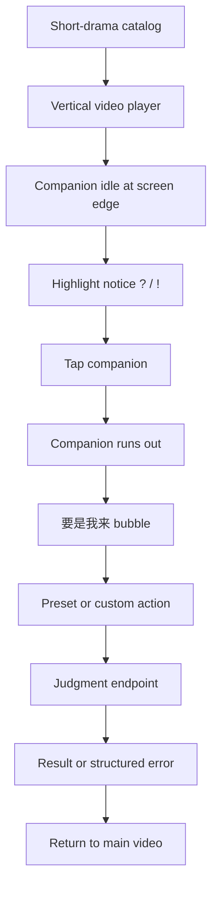

# 要是我来 PRD v0.3

> Branch: OSeria Branch 3  
> Product name: 要是我来  
> Internal codename: Deadman  
> English working name: If It Was Up To Me  
> Date: 2026-05-29  
> Target: Byte AI full-stack short-drama challenge  
> Status: latest consolidated PRD, supersedes v0.2 for product direction

## 0. Version Note

This v0.3 PRD consolidates the latest design decisions after v0.2:

- split the product into user-side player and producer-side Deadman Studio;
- keep user-side runtime player-first and moment-level;
- move producer orchestration toward LangGraph;
- add LLM semantic mining / LLM-as-judge as producer-side draft/enrichment;
- preserve CABRuntime as the formal judgment runtime path;
- make `cab_runtime` the default judgment path;
- keep `demo_deterministic` as an explicit demo/test fallback only.
- **v0.3.1 framing fix**: emotional first principle moved from *"the story
  world plausibly reacts"* to *"a watching friend recognizes and replies in
  kind"*. P0 does not deliver a branching world (§5); local causal consistency
  in §8–§9 is the runtime's internal KPI, not the user-facing promise.
  Resolves the prior §3 ↔ §5/§7.4 tension.

## 1. One-Line Definition

`要是我来` is a short-drama highlight intervention product. It lets viewers act
on the impulse "if I were there, I would do this" and receive a believable
friend reaction grounded in the current moment while staying inside the original
watching flow.

It is not a long-form RP client, not a generic chat companion, not a full
ArcForge world simulator, and not a real-time AI video generator.

## 2. Product Split

Deadman has two product surfaces.

| Surface | User | Core job | Runtime shape |
| --- | --- | --- | --- |
| User-side player | Short-drama viewer | Watch, notice a highlight, choose/type an action, receive a friend-style response grounded in the moment, continue watching | Mobile-first player + companion + judgment API |
| Deadman Studio | Producer/operator/creator | Convert raw short-drama material into reviewed runtime packs | LangGraph-compatible producer workflow + human review + validation |

This split is important because the viewer product is real-time entertainment,
while the producer product is an offline or semi-offline AI content production
pipeline.

## 3. User Insight

At a short-drama emotional peak, viewers often think:

- "要是我在这肯定不这么干。"
- "要我是主角，我直接反击。"
- "她现在不该忍，应该先录音取证。"
- "这资源要是我有，我肯定先救孩子，但不能暴露。"

This is not just commenting. It is a counterfactual intervention impulse — but
P0 does not deliver a real branching world (see §5). What P0 delivers is a
watching friend who gets the drama recognizing that move and replying in kind.

The first-principles emotional goal:

```text
Make the viewer feel:
"My watching friend heard my 'if it was up to me',
 got it, and replied with something that lands —
 the way a friend who actually knows this drama would."
```

The product value is the meta pleasure of being heard by someone who watches
drama with you:

- I understood the situation.
- I saw a better move than the protagonist.
- A watching friend who knows this drama heard it and replied in kind.
- The reply felt like a friend who actually knows this story would say it —
  not a generic chatbot, not a script-analysis report. (Local consistency with
  character/plot/genre is the runtime's internal KPI in §8–§9, not the
  user-facing promise.)

## 4. P0 Goal

P0 turns one short-drama highlight point into a believable interactive
consequence.

The viewer should be able to:

1. open a short-drama catalog;
2. enter a vertical player;
3. watch until a highlight moment;
4. see a companion notice;
5. choose A/B/C or type a custom action;
6. receive one natural companion response that uses verdict, causality,
   evidence/canon, visual, or aggregate material only when it helps the moment;
7. close the bubble and continue watching.

Success is not generating a long alternate plot. Success is whether the user
feels:

```text
这个判定像真的。
我这样选确实会这样。
甚至我这步比原剧情更聪明。
```

## 5. P0 Non-Goals

P0 does not include:

- iOS / HarmonyOS app;
- full creator/admin dashboard;
- real-time AI video generation;
- voice input/output;
- free companion chat;
- long-form RP or multi-character continuous simulation;
- arbitrary short-drama full automation without human review;
- making CABRuntime the default clean-deploy engine;
- treating generated/fallback images as proof;
- runtime promotion for every tested drama.

Android APK frontend plus FastAPI backend is the selected primary contest
delivery. Mobile Web plus backend remains the solo-track fallback. Desktop is
only a phone preview/recording shell.

## 6. User-Side Product Loop



## 7. User-Side UX Requirements

### 7.1 Mobile-first shell

- Design against phone portrait viewports: `390x844`, `393x852`, `430x932`.
- Primary surface is a 9:16 vertical short-drama player.
- Desktop shows a centered phone preview shell.
- Touch targets must be at least `44px`.
- Use native `button`, `input`, and `textarea`.
- Avoid hover-only interaction and dense desktop UI.

### 7.2 Companion

The companion is a tomato-hood girl in an oversized red sleeping robe. It is a
watching friend: present, mildly sharp, emotionally validating, not an analyst
or full chat agent.

P0 states:

| State | Behavior |
| --- | --- |
| `idle` | Half-hidden at the left edge. |
| `notice_question` / `notice_exclaim` | Shows `?` or `!` at the highlight moment. |
| `stand_bubble` | Opens the `要是我来` bubble. |
| `thinking` | Shows judging/loading state. |
| `verdict` | Shows result. |
| `error` | Shows structured failure. |
| `dismissed` | Returns to idle. |

P0 uses static transparent PNG/WebP assets plus CSS transitions. No Live2D,
APNG runtime, voice layer, or free chat is required.

### 7.3 Interaction bubble

The bubble includes:

- one short companion line that names the emotional trigger;
- three compact response/action strips;
- one lightweight custom mouthpiece input row;
- close / continue watching action.

The bubble should not read like a branch-choice questionnaire. The trigger
source is an emotionally charged short-drama beat that already makes viewers
want to talk back, not merely a neutral fork where the viewer is asked to choose
a plot branch.

The default trigger is in-scene, during the tension beat. After the interaction
window expires, tapping the idle companion should not reopen that old choice
surface. A post-beat reflective trigger can be added later as a separate
runtime moment.

### 7.4 Result Surface

The result should be a single natural-language companion response, not a fixed
stack of judgment fields.

Internal materials may include:

- companion verdict;
- local consequence;
- compact reason/evidence;
- canon/watch-flow rationale;
- visual result plan or fallback;
- aggregate hint as a compact percentage cue, such as `有52%其他观众也这么想`.

These are a response material library. The UI should select only what fits the
moment, usually zero or one supporting cue, and blend it into the companion's
natural language. The only stable visible action is continue watching.

For P0 demo, the percentage cue may come from a static synthetic distribution
attached to the reviewed moment/action option. A production system can replace
that cue with persisted viewer-choice aggregates; until then, the percentage is
a demo surface, not a claim of real audience voting.

The companion should not explain that the user's choice has no real plot impact.
Phrases like `原剧情还能继续`, `不改写主线`, `不影响剧情`, `只改变眼前`, or
`先别把这步当剧情结论` are banned from viewer-facing copy. Those constraints
belong inside runtime policy and evaluation, not inside the emotional surface.

The result must not feel like script analysis or another field table. It should
feel like a friend who understands the drama and gives a credible reaction.

## 8. Moment Causality Engine

The engine must not be "LLM writes a branch directly." The correct runtime chain:

```text
user action
  -> action routing
  -> typed Moment Pack constraints
  -> local causality judgment
  -> structured result / error
  -> companion-facing natural language
```

Judgment scope is local:

- current scene;
- immediate aftermath;
- no later-episode branch claim;
- no "canon was wrong" claim;
- no visual-as-proof claim.

P0 internal fields are not exposed as raw UI tables. The visible experience
translates them into short evidence and consequence language.

## 9. Moment Field And Pack Model

The current field contract comes from multi-drama induction and red-team:

- foundation drama: `荒年全村啃树皮，我有系统满仓肉`;
- migration evidence: `云渺`, `幸得相遇离婚时`;
- minimum field compression: Moment Field Minimum Set v0.3;
- typed subkey patch after red-team.

Core fields:

- `actor_local_state`;
- `critical_stakes_state`;
- `local_constraint_state`;
- `escalation_risk`;
- `canon_baseline`;
- `watch_flow_rationale`.

Reusable optional modules:

- `relationship_state`;
- `capability_rules`;
- `information_asymmetry`;
- `proof_state`;
- `audience_reputation_state`.

P0 must not add global branch timeline, long-term relationship simulation, full
social graph mutation, or global inventory simulation.

## 10. Backend Runtime Boundary

Current backend state:

- FastAPI backend exists under `backend`;
- deployment entry is mounted through `server.py`;
- default judgment service is `cab_runtime`;
- deterministic demo/test judgment is available only behind
  `DEADMAN_JUDGMENT_ENGINE=demo_deterministic`;
- adapter mapping can build v0.3 typed input for all promoted Huangnian moments.

`demo_deterministic` behavior is allowed only as a demo/test boundary. It is not
formal model judgment and not a fallback for the formal path.

Formal path:

```text
backend/adapter_mapping.py
  -> build_adapter_input(...)

backend/runtime_client.py
  -> call CABRuntime host adapter
  -> return adapter output or structured runtime error

backend/judgment.py
  -> preserve public response shape
  -> translate runtime output/error into viewer result/error state
```

Formal failure rule:

```text
runtime unavailable
provider timeout
schema validation failure
guardrail violation
pack mapping failure
  -> structured error
  -> frontend renders error state
```

No formal path may silently return deterministic/template judgment as fallback.

## 11. Visual And Voice Policy

Visual result policy:

- P0 can show placeholder, pregenerated image, current-frame card, or text-only
  fallback.
- Image generation provider is not connected yet.
- Custom input may attempt synchronous image generation only after latency,
  quality, actor-likeness safety, fallback behavior, and proof contamination are
  tested.
- Visuals must never be treated as proof.

Voice policy:

- All dedicated voice capability belongs to P1.
- P0 uses native text input so OS dictation or external IME can work naturally.
- Future P1 may add companion TTS/STT, but it must be muteable and not talk over
  drama dialogue by default.

## 12. Producer-Side Product: Deadman Studio

Deadman Studio is the production surface that turns raw short-drama material
into runtime packs.

Producer flow:

```text
local MP4s
  -> media registry
  -> ASR / timeline windows / keyframes
  -> deterministic recall
  -> LLM semantic mining
  -> LLM-as-judge screening
  -> human review
  -> Drama Context Pack
  -> Moment Causality Packs
  -> validation
  -> player consumption
```

Deadman Studio P0+ is CLI/report first, not a polished creator platform.

## 13. Why LangGraph On Producer Side

Production is a multi-stage, auditable, resumable workflow. It benefits from
LangGraph because it needs:

- named nodes;
- checkpointed runs;
- human review pause/resume;
- artifact logs;
- failure isolation;
- reviewable reports.

LangGraph is producer-side only. It should not be used as the user-side
judgment runtime.

Base LangGraph wrapper:

- wraps existing ARS/producer CLI scripts as nodes;
- runs Huangnian P0 closed loop;
- uses file-based human review gate;
- does not add provider integration.

LLM producer extension:

- treats deterministic ARS as cheap/auditable recall;
- adds `llm_semantic_miner`;
- adds `llm_candidate_judge`;
- drafts Drama Context Pack and Moment Pack content;
- still requires human review plus producer validation before runtime
  promotion.

## 14. Demo Material Strategy

| Drama | Current role | Runtime status |
| --- | --- | --- |
| `荒年全村啃树皮，我有系统满仓肉` | Foundation demo | Promoted P0 runtime pack exists. |
| `云渺` | Migration evidence for supernatural/cultivation constraints | Not runtime-promoted. |
| `幸得相遇离婚时` | Migration evidence for betrayal/revenge/social leverage constraints | Not runtime-promoted. |

Only Huangnian should be used as the current P0 runtime demo unless additional
human review and promotion work is completed.

## 15. Current Implemented P0

Implemented:

- mobile-first React/Vite frontend;
- catalog entry;
- vertical player;
- companion state machine;
- highlight markers from backend moment packs;
- preset/custom action submission;
- FastAPI Deadman API;
- registered media route;
- public metadata redaction;
- deterministic demo/test judgment;
- CABRuntime-backed formal judgment behind env activation;
- aggregate static demo percentage cue;
- error bubble for API/formal failure style;
- Huangnian reviewed runtime pack;
- producer validation and submission readiness gates.

Not implemented:

- making CABRuntime the default clean-deploy engine;
- persistent runtime trace storage;
- image-generation provider;
- real persistent aggregate stats or vote pipeline;
- multi-drama runtime promotion;
- P1 voice layer;
- polished Deadman Studio UI.

## 16. Acceptance Criteria

P0 is acceptable when:

- catalog opens on mobile viewport;
- player loads the selected Huangnian episode;
- companion idle/notice/invite/bubble/result/error states are visible;
- timestamp marker triggers at the pack-defined window;
- preset and custom actions call the backend;
- result text is emotionally satisfying and locally credible;
- result may draw on canon/watch-flow or one compact percentage cue, but does not expose
  every internal material as a fixed UI row;
- formal/API failure renders error and retry/continue actions;
- no raw producer paths or debug fields leak to public API;
- no MP4/MOV, `.env`, raw provider output, or secrets are committed;
- producer validation passes for Huangnian;
- submission readiness gate passes for local demo or clearly reports missing
  external media configuration.

## 17. Submission Claims

Safe claims:

- Deadman demonstrates a mobile-first short-drama interaction layer.
- Primary P0 delivery is Android APK frontend plus FastAPI backend; mobile Web
  remains a fallback and development preview.
- The user-side demo consumes reviewed runtime packs.
- Producer bridge can turn local drama material and reviewed evidence into
  player-consumable packs.
- Moment Field Minimum Set v0.3 was induced from Huangnian plus migration
  evidence and red-team patched.
- LangGraph is planned for producer-side orchestration, not user-side runtime.
- CABRuntime-backed judgment can be activated with
  `DEADMAN_JUDGMENT_ENGINE=cab_runtime` and must pass the CAB readiness gate
  before being claimed.

Unsafe claims:

- CABRuntime judgment is the default clean deployment mode.
- CABRuntime judgment works in an environment where the CAB readiness gate has
  not passed.
- Image generation provider is connected.
- Yunmiao/Lihun are runtime-promoted demos.
- The system automatically ingests arbitrary short dramas without human review.
- Generated visuals prove what happened.
- P0 creates a continuing alternate timeline.

## 18. Key Source Documents

- Material map: `docs/Submission_Material_Map_v0.1.md`
- Technical draft: `docs/Competition_Technical_Doc_Draft_v0.1.md`
- User-side acceptance: `docs/P0_Mobile_UX_Acceptance_Checklist_v0.1.md`
- CABRuntime integration: `docs/CABRuntime_SDK_Integration_Contract_v0.1.md`
- Producer flow: `docs/Producer_Bridge_Minimum_Flow_v0.1.md`
- Producer brief: `docs/Deadman_Studio_Zero_Context_Product_Brief_v0.1.md`
- LangGraph producer plan: `docs/goal_spec/Deadman_LangGraph_Producer_Pipeline_v0.1.md`
- LLM producer extension: `docs/goal_spec/Deadman_LangGraph_Producer_LLM_Extension_v0.1.md`
- Moment field set: `docs/Moment_Field_Minimum_Set_v0.3.md`
- Moment pack draft: `docs/Moment_Causality_Pack_v0.3_Draft.md`
