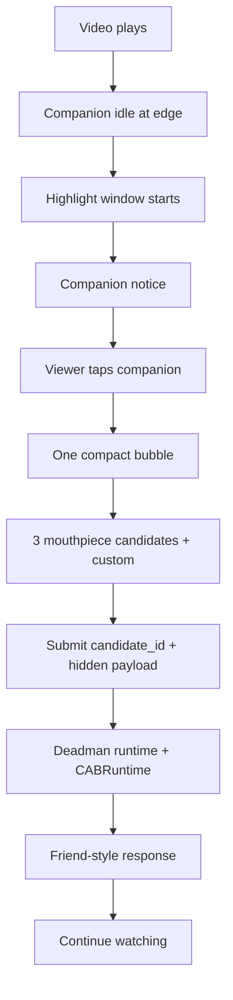

# 要是我来 PRD v0.4 UX Core

> Branch: OSeria Branch 3  
> Product name: 要是我来  
> Internal codename: Deadman  
> Date: 2026-06-03  
> Status: new UX-core PRD, supersedes v0.3 where UX / option contract / Studio candidate production conflict  
> Context log: `docs/Branch3_UX_Core_Pivot_Log_v0.1.md`

## 0. Version Note

v0.4 is a product-direction correction after v0.3 and the companion detail spec.

The previous stable direction remains valid in these areas:

- mobile-first short-drama player;
- resident tomato companion;
- Deadman user-side runtime around CABRuntime;
- Deadman Studio producer-side workflow;
- fail-closed formal judgment;
- no long alternate timeline;
- no free chat in P0;
- no raw field-table result surface.

The corrected direction is:

```text
The user mind is not "choose a branch."
The user mind is "I want to say one thing."
```

The three preset strips are no longer product-defined as actions or branch
choices. They are product-defined as `mouthpiece_candidates`: three attempts to
surface what the viewer may already want to say.

## 1. One-Line Definition

`要是我来` is a short-drama watching companion product that catches the moment
when the viewer wants to talk back, offers three precise "words on the tip of
the tongue," lets the viewer submit one or type their own, and returns a
friend-style response grounded by a governed runtime.

## 2. Product Thesis

Short-drama viewers often do not want a full branch or chat session. At the
heated moment, they want to say:

```text
这不对。
凭什么。
先护住她。
这口气不能忍。
我懂她为什么这样。
```

The product should make that impulse easy to express without making the viewer
learn a game system.

The system can be heavy underneath. The user-side mind must stay light.

## 3. Core UX Principle

```text
我想说一句。
```

Everything else serves this.

| Product layer | Core job |
| --- | --- |
| User-side UI | Let the viewer say the one thing with almost no cognitive load. |
| Deadman runtime | Make that one thing a governed, stateful, auditable runtime event. |
| CABRuntime | Execute/check the semantic event through a safe structured runtime path. |
| Deadman Studio | Produce the three best mouthpiece candidates for each scene. |

The frontend is allowed to be visually simple only because the runtime and
producer contracts are strict.

## 4. User Problem

The viewer sees a short-drama beat that is emotionally loaded, but normal video
watching gives them only passive consumption. Comment sections are delayed and
socially noisy; full chat/RP is too much; branch-choice UIs feel like a game
instead of a watching moment.

The unresolved need:

```text
I want to say the thing this scene made me feel, and I want the product to make
me feel understood without dragging me out of the episode.
```

## 5. Target Users

Primary P0 user:

- short-drama viewer;
- watches vertical video on phone;
- enjoys emotionally hot points, reversal, humiliation, family pressure,
  resource scarcity, or survival tradeoff scenes;
- wants lightweight expression, not a full game.

Secondary P0 user:

- demo evaluator / product judge;
- needs to see that the interaction is not just a frontend overlay;
- needs visible evidence that reviewed packs, runtime, and CAB boundary exist.

Producer-side user:

- creator/operator preparing drama material;
- needs to turn raw episodes into reviewed runtime packs;
- needs repeatable candidate production and review, not one-off manual copywriting.

## 6. Product Surfaces

| Surface | User | Core task | P0 shape |
| --- | --- | --- | --- |
| User-side player | Viewer | Say one scene-grounded line and get a friend response | Mobile vertical player + resident companion + one compact interaction surface |
| Deadman runtime | System/engine | Govern state, timing, candidate submission, CAB call, result mapping | Event API + viewer session + adapter mapping + friend voice |
| Deadman Studio | Producer/operator | Produce and validate moments plus mouthpiece candidates | CLI/report/LangGraph-compatible flow + human review + validation |

## 7. User-Side Loop



The product should not present this as "choose what happens next." It should
present it as "which one is the thing you want to say?"

## 8. UX Requirements

### 8.1 Mobile-first frame

- Design against `390x844`, `393x852`, and `430x932`.
- Primary surface is 9:16 vertical video.
- Desktop is only a phone-preview shell.
- Companion and bubble must not fight subtitles or core face/action regions.
- Tappable controls must not overlap playback controls.

### 8.2 Companion presence

The tomato companion is a watching friend:

- half-hidden at the screen edge in idle;
- slightly animated through lightweight CSS / static state assets;
- notices high-emotion windows;
- can be tapped only when runtime policy says the current moment is eligible;
- returns to idle after dismiss/continue;
- does not become a free chat bot in P0.

### 8.3 Interaction surface

The interaction surface contains:

- one short emotional lead from the companion;
- three `mouthpiece_candidates`;
- one custom entry row;
- close/dismiss;
- no explicit two-mode split.

The surface must not say:

- "你要怎么做？"
- "展开 if 线"
- "选择分支"
- "改变剧情"
- "原剧情还能继续"

Allowed framing examples:

- "火气点 · 你是不是也想说"
- "这口气，你想怎么接？"
- "哪句像你想说的？"
- "我有不同想法"

### 8.4 Candidate display

Visible candidate text should be short, emotionally legible, and distinct.

Examples:

```text
凭什么啊
先护住她
别让她白挨
这肉得有四蛋一口
来路先别说破
这功劳算孩子的
```

Bad examples:

```text
当场让儿媳上桌，直接推翻旧规矩
今晚分兔肉，先让四蛋确认自己也有份
展开 if 线讨论这个节点
这句判断有现场证据托着
```

### 8.5 Result surface

Result is one friend-style response plus optional micro-cue.

Visible stable elements:

- companion stamp, such as `懂你❤`, `就是啊`, `接住了`;
- single natural-language response;
- optional small aggregate line, such as `有52%其他观众也这么想`;
- `继续看`;
- optional `分享`.

Do not show raw:

- score axes;
- evidence refs;
- applied constraints;
- field names;
- CAB schema names;
- plot-impact disclaimers.

## 9. `mouthpiece_candidate` Contract

The primary contract change is to promote `mouthpiece_candidates` above
`default_options`.

Minimum candidate object:

```json
{
  "candidate_id": "preset_0",
  "display_text": "先护住她",
  "action_payload": {
    "text": "先站到儿媳这边，把她从被羞辱的位置上拉出来，再处理桌规。",
    "action_type": "humiliation",
    "intent": "protect_dignity",
    "target_actors": ["儿媳"],
    "risk_posture": "balanced"
  },
  "emotion_role": "心疼护住",
  "semantic_role": "restore_dignity",
  "distinctness_rationale": "区别于当场掀桌或先换饭，重点是先站队护人。",
  "evidence_refs": ["episode07_window_003"],
  "constraint_refs": ["family_power_order", "public_humiliation_risk"],
  "friend_voice_seed": "对，先别让她一个人被晾在那。"
}
```

Field rules:

| Field | Purpose | UI visible? |
| --- | --- | --- |
| `candidate_id` | Stable runtime id | No |
| `display_text` | Short text shown to viewer | Yes |
| `action_payload` | Semantic payload for judgment/CAB | No |
| `emotion_role` | Emotional outlet category | No by default |
| `semantic_role` | Distinctness and validation | No |
| `distinctness_rationale` | Producer/human review | No |
| `evidence_refs` | Grounding | No |
| `constraint_refs` | Runtime constraints | No |
| `friend_voice_seed` | Optional response material | No by default |

`default_options` may remain as a legacy fallback during migration but must not
be the primary authoring target after v0.4 implementation starts.

## 10. Candidate Quality Bar

Each promoted moment must have exactly three candidates.

The three candidates must differ by semantic role, not just wording.

For example, in a humiliation scene:

| Candidate | Role |
| --- | --- |
| `凭什么啊` | Direct outrage / challenge the rule |
| `先护住她` | Care/protection before argument |
| `别让她白挨` | Restore dignity / make the harm count |

These are valid if the hidden payloads are genuinely different.

Invalid set:

| Candidate | Why invalid |
| --- | --- |
| `让她上桌` | Action option |
| `换那碗饭` | Action option |
| `别让她白挨` | Mixed level, only one is a mouthpiece |

This set may still contain useful production material, but Studio must rewrite
it into distinct mouthpiece roles before publication.

## 11. Runtime / CABRuntime Requirements

The user-side runtime is not a passive frontend display. It owns the event loop.

P0 runtime responsibilities:

1. Maintain `viewer_session_id`.
2. Track active drama, episode, moment, playback time, interaction window, and
   completed moment ids.
3. Decide whether companion tap can open the current surface.
4. Serve the three approved `mouthpiece_candidates`.
5. Submit `candidate_id + action_payload` for preset candidates.
6. Submit raw text only for custom input.
7. Verify submitted candidate id still belongs to the active moment.
8. Call CABRuntime only for runtime-worthy user action events.
9. Fail closed on mapping, CAB, provider, schema, or guardrail failure.
10. Return product-safe companion output, not raw runtime internals.

CABRuntime responsibilities:

- execute/check the submitted semantic event through a structured runtime path;
- return structured success/error;
- preserve protocol and worker/session safety;
- expose enough traceability for Deadman readiness gates;
- never own Deadman's product copy, companion state, or scene-candidate semantics.

Deadman responsibilities:

- host session state;
- moment pack lookup;
- candidate-payload mapping;
- result-to-friend-voice composition;
- UI state/pacing;
- product-safe persistence rules.

## 12. Deadman Studio Requirements

Deadman Studio's core job after v0.4:

```text
produce the three likely things viewers want to say at this exact beat
```

Producer flow:

```text
media / transcript / windows
  -> deterministic recall
  -> LLM semantic mining
  -> LLM candidate judge
  -> mouthpiece candidate drafting
  -> human review
  -> pack publish
  -> validator
  -> player consumption
```

The Studio validator must reject:

- fewer or more than three candidates;
- duplicate `semantic_role`;
- display text too long;
- missing hidden payload;
- missing evidence refs;
- missing constraint refs;
- future-branch claims;
- visual proof claims;
- options that are merely action-menu strings;
- candidates that cannot be explained as likely viewer speech.

Human review must see, side by side:

- display text;
- full hidden payload;
- emotion role;
- semantic role;
- distinctness rationale;
- evidence refs;
- constraint refs;
- reviewer approval/rewrite fields.

## 13. Data / API Migration

Backward-compatible migration:

1. Keep `action_space.default_options` for existing packs and old tests.
2. Add `action_space.mouthpiece_candidates_schema_version`.
3. Add `action_space.mouthpiece_candidates`.
4. Backend moment summaries expose both fields during migration.
5. Frontend prefers `mouthpiece_candidates`; falls back to compacted
   `default_options` only when candidates are absent.
6. Fallback candidates must be marked `requires_review=true` in backend or
   validation metadata.

Runtime submission shape should become:

```json
{
  "source": "preset_candidate",
  "candidate_id": "preset_0",
  "text": "先护住她",
  "action_payload": {
    "text": "先站到儿媳这边，把她从被羞辱的位置上拉出来，再处理桌规。",
    "action_type": "humiliation",
    "intent": "protect_dignity"
  }
}
```

Legacy `source="preset"` remains accepted only for old packs during migration.

## 14. Friend Voice Requirements

Friend voice must sound like a drama-watching companion, not an analyst.

Hard rules:

- result response target length: 28-58 Chinese characters;
- no field names;
- no "当前场景", "局部后果", "现场证据", "判定", "约束";
- no plot-impact disclaimer;
- no "AI" self-explanation;
- no moral lecture;
- no repeated generic lead bank.

Preferred style:

```text
我接住你咯。
这句我懂。她不是来受这口气的，先有人站出来，后面才有余地。
```

Micro-cue examples:

```text
有52%其他观众也这么想。
这手爽是爽，搭子建议收一点。
```

Bad:

```text
这句判断有现场证据托着。
当前场景中该动作会产生局部后果。
原剧情还能继续。
```

## 15. Non-Goals

P0 does not include:

- full alternate timeline;
- multi-turn free chat;
- long RP;
- voice input/output as product feature;
- image-generation provider;
- persistent user account;
- real aggregate voting backend;
- polished Studio UI;
- autonomous publication without human review;
- calling CABRuntime on every playback tick;
- exposing CAB/runtime internals to the viewer.

## 16. Success Metrics

P0 demo metrics:

- viewer can understand the interaction without explanation within 5 seconds
  of first notice;
- at least one of the three candidates feels like a plausible "I wanted to say
  that" option in manual review;
- result response does not read like a field table;
- no visible branch/RPG wording appears in the player;
- formal runtime failure renders error, not fake judgment;
- producer validator catches invalid candidate sets.

Production-readiness metrics:

- every promoted moment has exactly three reviewed `mouthpiece_candidates`;
- candidate semantic roles are distinct;
- candidates cite evidence and constraints;
- frontend can swap episode packs without code changes;
- CAB readiness gate proves formal runtime path for at least the active demo
  moment.

## 17. P0 Requirements

### P0.1 Contract patch

- Add `mouthpiece_candidates` schema.
- Add backend model fields.
- Keep legacy `default_options` fallback.
- Add validator rules for candidate count, length, roles, grounding, and banned
  branch wording.

### P0.2 User-side runtime patch

- Frontend renders `display_text`.
- Runtime submits `candidate_id + action_payload`.
- Backend verifies candidate belongs to active moment.
- CAB path consumes hidden payload.
- Completed moments cannot reopen after successful continue.

### P0.3 UI copy patch

- Replace "你要怎么做" framing with "我想说一句" framing.
- Keep one-level candidate/custom surface.
- Remove "展开 if 线" and similar two-mode labels.
- Keep companion small, edge-attached, and non-overlapping with controls.

### P0.4 Friend voice patch

- Remove analysis-style lead bank.
- Use candidate `friend_voice_seed` when available.
- Sanitize banned disclaimer and field-table phrases.
- Add tests for tone and length.

### P0.5 Studio patch

- Update LLM semantic and moment-pack draft schemas.
- Update mock fixtures.
- Update human review artifact to include candidate distinctness.
- Update producer validation.

## 18. Acceptance Criteria

User-side:

- [ ] Companion notice appears only in active window.
- [ ] Tap outside active/completed moment does not open choices.
- [ ] Inside active window, tap opens one compact surface.
- [ ] Surface shows exactly three short candidates plus custom entry.
- [ ] No visible "branch", "if line", "choose what happens", or plot-impact
      disclaimer copy.
- [ ] Candidate click submits stable candidate id and hidden payload.
- [ ] Custom input submits user text without fabricated payload.
- [ ] Result is a single friend-style response plus optional micro-cue.
- [ ] Continue returns to video and marks the moment completed for the current
      watch pass.

Runtime / CAB:

- [ ] Legacy packs still work through fallback.
- [ ] New packs prefer `mouthpiece_candidates`.
- [ ] Candidate id mismatch fails with structured error.
- [ ] CABRuntime unavailable / provider timeout / schema failure returns
      structured error.
- [ ] No formal path silently falls back to demo deterministic judgment.
- [ ] Session trace includes moment id, candidate id, and engine mode.

Producer / Studio:

- [ ] Published moment has exactly three candidates.
- [ ] `display_text` length gate passes.
- [ ] Three `semantic_role` values are distinct.
- [ ] Every candidate has evidence refs and constraint refs.
- [ ] Human review can approve, rewrite, or reject each candidate.
- [ ] Validator blocks action-menu-style candidates.

## 19. Open Questions

These require product confirmation but do not block starting the contract patch:

1. Hard display length: should the default limit be 10, 12, or 14 Chinese
   characters?
2. Custom entry label: should it be `我有不同想法`, `我想自己说`, or another
   phrase?
3. Stamp pool: should P0 use only `懂你❤ / 就是啊 / 接住了`, or keep a larger
   pool?
4. Aggregate cue: should demo-static percentages attach to candidate id now, or
   remain result-level until a real aggregate pipeline exists?
5. Review gate: should mouthpiece candidate review be part of moment promotion
   or a separate second review stage?

## 20. Source Documents

- `docs/Branch3_UX_Core_Pivot_Log_v0.1.md`
- `docs/Branch3_要是我来_PRD_v0.3.md`
- `docs/Resident_Companion_Runtime_Tech_Plan_v0.1.md`
- `docs/Branch3_Companion_Product_Detail_Spec_v0.1.md`
- `docs/Branch3_Demo_Episode_Pack_Contract_v0.1.md`
- `docs/Deadman_Studio_Implementation_Contract_v0.1.md`
- `docs/goal_spec/Deadman_LangGraph_Producer_Pipeline_v0.1.md`
- `docs/goal_spec/Deadman_LangGraph_Producer_LLM_Extension_v0.1.md`

