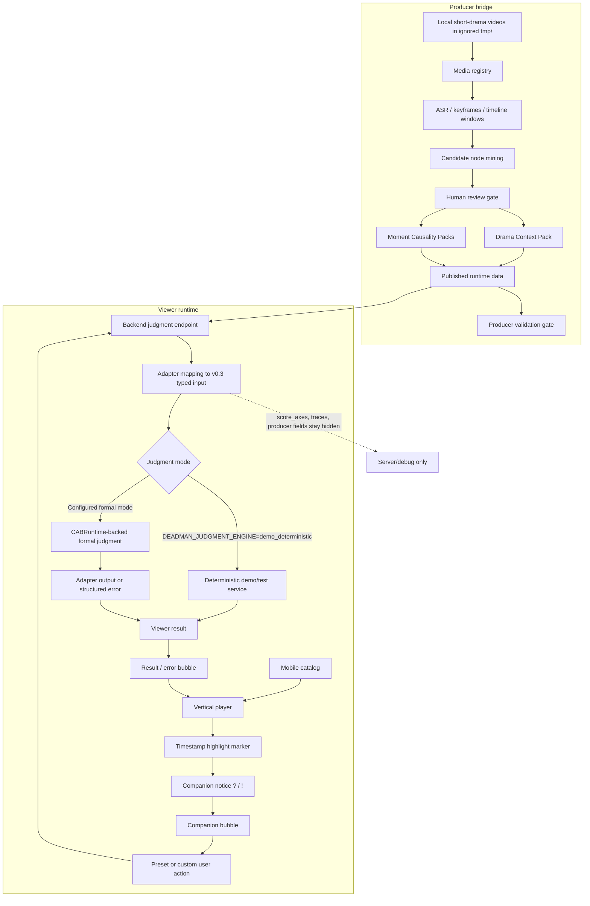

# Competition Technical Document Draft v0.1

> Product: Deadman / `要是我来`
> Target: Byte AI full-stack short-drama challenge
> Draft status: Feishu-ready technical draft
> Date: 2026-05-25
> Claim boundary: 当前文档只描述已落地的 Deadman P0 viewer/runtime 链路、已冻结或已验证的文档合同，以及由 readiness gate 约束的 CABRuntime-backed formal judgment 路径。`demo_deterministic` 只保留为显式 demo/test fallback。
> Publicization note: this was drafted before the standalone Deadman extraction.
> `Runtime/frontend` references describe the original source-workspace
> compatibility bridge, not a current dependency of the standalone repo.

## 0. Document Claim Boundary

这份文档用于比赛技术说明，不是营销页，也不是 North Star 架构承诺。

当前可以诚实表达的状态：

- Deadman 是 OSeria Branch 3 / `要是我来` 的当前实现面。
- P0 delivery 主线调整为 `Android APK frontend + FastAPI backend`；移动端 Web
  仍作为开发预览和单人 fallback。
- `荒年全村啃树皮，我有系统满仓肉` 已作为 foundation demo material，存在 reviewed runtime pack。
- Producer bridge 已形成从本地素材、ARS 证据、人审节点到 runtime pack 的可复现链路。
- Moment Field Minimum Set v0.3 已完成字段归纳和 red-team patch，支持 moment-level local consequence judgment。
- Backend adapter mapping 已能把 promoted Huangnian v0.1 packs 映射成 v0.3 typed view 和 `deadman_judgment_adapter_input.v0.1`。
- 当前代码默认指向 CABRuntime-backed formal path，但只能在目标环境通过
  `deadman_check_submission_readiness.py --require-cab-runtime` 后宣称该环境 formal judgment 可用。
- `demo_deterministic` 只作为显式 demo/test fallback，不是正式模型判定，也不是 CABRuntime fallback。

当前不能过度表达的状态：

- 没有通过 CAB readiness gate 的环境不能宣称 formal CABRuntime judgment 已可用。
- 还没有持久化 runtime trace 存储策略可以作为长期审计证明。
- 没有接入 image generation provider。
- `云渺` / `幸得相遇离婚时` 只作为 migration evidence 和 field-induction 证据，不是 runtime-promoted demo。
- P0 只判断当前高光点的局部可信后果，不承诺生成连续分支剧情或改写后续剧集。

## 1. Project Summary

`要是我来` 是一个短剧高光点剧情介入判定系统。

用户在看短剧时，经常会在某个情绪点产生冲动：

```text
这一步要是我来，我肯定不会这么选。
```

Deadman 把这个冲动做成一个 mobile-first 观看内互动层：在指定高光时间点，屏幕边缘的 companion 提醒用户可以介入；用户选择 A/B/C 或输入自己的行动；后端基于 scene-level Moment Causality Pack 判断这个行动在当前场景里的可信后果，并把结果以 companion verdict、后果文本、证据说明、视觉占位或 fallback 的形式返回。

P0 技术交付形态：

```text
Android APK frontend + FastAPI backend + JSON runtime packs + producer bridge CLI/report
```

核心不是“让用户进入一个长线 RP 世界”，而是在短剧观看流里回答一个更小、更尖的问题：

```text
如果这一幕我这么做，当前场景会怎么反应？
```

## 2. Problem And User Need

比赛命题要求围绕短剧播放、情节点识别、即时互动和后端服务形成完整闭环。Deadman 对应的是短剧用户的“反事实介入”需求，而不是泛评论、弹幕或固定互动剧按钮。

用户真实需求可以拆成三层：

| Layer | User need | Product consequence |
| --- | --- | --- |
| Emotion | 我想吐槽、反击、改写这一刻 | 互动入口必须出现在观看中的情绪高点，而不是独立工具页 |
| Judgment | 我想知道我的选择是否更聪明 | 后端必须输出可信后果，而不是只显示“你选择了 B” |
| Return-to-watch | 我还要继续看原剧 | 结果必须解释局部后果，同时保留返回原观看流的理由 |

因此 P0 不追求长线分支模拟。它追求的是：

```text
一个高光点 -> 一个用户行动 -> 一个局部可信后果 -> 回到主视频
```

## 3. Product Boundary

### 3.1 P0 Includes

- 短剧 catalog。
- 竖屏 player。
- 时间点高光 marker。
- companion idle / notice / invite / bubble / judging / result / error / dismissed 状态。
- A/B/C preset actions。
- custom action input。
- 后端读取 reviewed Moment Causality Packs。
- 后端返回 consequence result 或 structured error。
- Producer bridge 用 CLI/report 证明素材到 runtime pack 的可复现路径。
- Feishu 技术文档和 demo recording 脚本。

### 3.2 P0 Does Not Include

- iOS / HarmonyOS app。
- 完整 creator/admin dashboard。
- 实时 AI 视频生成。
- 语音输入/输出。
- 长线 RP 或多角色连续模拟。
- 任意短剧全自动 ingestion。
- 未通过 readiness gate 的正式 CABRuntime model/runtime 成功声明。
- 把生成图或 fallback 图当作剧情证据。

产品后果：P0 的验收重点是“短剧观看流中的一次可信介入”，不是“完整互动剧平台”。

## 4. Module Analysis

| Module | Responsibility | Current status | Product consequence |
| --- | --- | --- | --- |
| Viewer frontend | catalog、竖屏 player、companion、bubble、result/error states | `frontend` 是 canonical standalone Vite package | 用户第一屏应该是可录屏的手机观看体验，不是桌面管理后台 |
| Historical host bridge | 原 OSeria-Alter workspace 中的 legacy demo URL | 不属于 standalone Deadman 当前依赖 | 保留为历史背景，不作为公开项目运行条件 |
| Backend API | drama/moment loading、judgment endpoint、public response shape | `backend` FastAPI API 存在，并已挂到部署入口 `server.py`；默认 judgment 是 `cab_runtime` | 能跑通 P0，但不能把 demo deterministic fallback 包装成正式 AI 判定 |
| Pack store | 加载 tracked drama packs | `data/dramas/huangnian` 有 context、manifest、media registry、moments、evidence | Demo 能基于 reviewed pack 展示，而不是临场硬编码 |
| Producer bridge | 本地素材注册、ARS、候选节点、人审、发布 pack、验证 | CLI/report first；已有 Huangnian rerun sequence、validation gate、public registry redaction、registered media route | 技术深度来自“素材可以变成 runtime pack”，但 P0 不做完整创作者平台 |
| Moment Causality Pack | 描述高光点、行动空间、局部约束、后果合同 | v0.3 minimum set 与 schema 已准备；Huangnian v0.1 pack 可映射到 typed view | 模型或 deterministic service 不应该从散文里重猜因果字段 |
| Backend adapter mapping | v0.1 promoted moments -> v0.3 typed moment pack -> adapter input | 5/5 Huangnian promoted moments 已通过 mapping 和 schema validation | 未来接 CABRuntime 时有窄边界，不需要重写 frontend/player/producer bridge |
| CABRuntime integration | 正式 runtime/model execution、schema enforcement、provider error handling | `runtime_client.py` 已可调用 CABRuntime host adapter；`--require-cab-runtime` 可验收端到端 judgment 和 resident runtime session loop | 正式判定失败时必须返回 structured error，不能用模板结果假装成功 |
| Visual result layer | result media slot、fallback policy、visual truth boundary | schema/plan 已准备，provider 未连接 | 可以展示占位或 fallback，但不能声称图像是剧情证据 |
| Migration evidence | 用 `云渺` / `幸得相遇离婚时` 验证字段迁移压力 | 当前是 evidence / induction material | 不能在比赛 demo 中说它们已是 runtime-promoted 多剧种 demo |

## 5. Core Technical Choices

| Area | Choice | Why this choice | Boundary |
| --- | --- | --- | --- |
| Frontend | React + Vite + mobile-first H5/PWA shape | 对 solo full-stack challenge 迭代最快，录屏和部署成本低 | 桌面只包一层 phone preview shell，不做独立桌面产品流 |
| Backend | FastAPI | endpoint 清晰，适合本地和轻量部署；方便与 JSON pack / Python producer tools 同仓协作 | 不是最终 runtime platform |
| Runtime data | tracked JSON packs under `data/dramas` | 可 review、可 diff、可被测试读取，适合 P0 | 不把 raw MP4/MOV、`.env`、provider output 放进 tracked data |
| Source bridge | ARS scripts + human review + publish/validate gate | 证明从短剧素材到 runtime pack 的过程可复现 | ASR/OCR/keyframe 是 evidence hint，不是 runtime truth |
| Moment schema | Moment Field Minimum Set v0.3 | 字段来自 Huangnian + migration evidence + red team，而不是拍脑袋 | 只支持 moment-level consequence，不支持全局世界模拟 |
| Judgment boundary | configured formal mode `cab_runtime` + explicit `demo_deterministic` demo/test fallback | 让正式路径有 readiness gate，同时保留可控测试降级 | 正式路径不能 deterministic fallback，部署 claim 必须同环境验收 |
| Error policy | fail-closed structured error | provider/runtime/schema failure 不应该伪装成判定成功 | 前端要显示 error state，并允许 retry/close |
| Visual policy | preset slot / placeholder / text fallback first | image provider 速度、质量、人物相似安全和 proof contamination 都未验证 | 图像永远不能作为 proof |
| Storage | JSON for P0, SQLite later if needed | P0 更需要可读、可审、可提交的 pack 文件 | 只有在交互记录和统计增长后再决定 SQLite |

## 6. Main Technical Flow



Flow interpretation:

- Producer bridge 把素材变成 reviewed runtime packs。
- Viewer runtime 消费这些 packs，触发 companion 互动。
- P0 demo/test 可以显式使用 deterministic service 返回 bounded result。
- 默认配置指向 `DEADMAN_JUDGMENT_ENGINE=cab_runtime`，启用
  `adapter_mapping.py -> runtime_client.py -> judgment.py` formal path；正式可用性必须由目标环境 readiness gate 证明。
- 如果 formal runtime/provider 失败，产品应显示 structured error，不返回模板判定假装成功。

## 7. Key Data And Contract Shape

### 7.1 Moment Field Minimum Set

P0 的 Moment Causality Pack 不做完整世界模拟，只保留局部判定需要的字段。

Core fields:

| Category | Fields |
| --- | --- |
| CoreOperational | `source_window`, `review_and_provenance`, `companion_entry`, `action_space`, `response_contract`, `visual_result_policy` |
| CoreCausal | `actor_local_state`, `critical_stakes_state`, `local_constraint_state`, `escalation_risk`, `canon_baseline`, `watch_flow_rationale` |
| ReusableCausalityModules | `relationship_state`, `capability_rules`, `information_asymmetry`, `proof_state`, `audience_reputation_state` |
| ProducerOnlyFields | `score_axes` |

Explicitly excluded:

- `branch_timeline`
- `global_inventory`
- `full_social_graph`
- `auto_visual_truth`
- `return_to_plot_fit`

产品后果：Deadman 可以判断“这一幕这样做会怎样”，但不会承诺“后面所有剧情从此改写”。

### 7.2 Backend Adapter Mapping

当前 Huangnian promoted packs 仍是 v0.1 形态。为了未来接 CABRuntime，不允许正式路径直接读取 v0.1 prose 再让模型重猜字段。

当前 mapping chain:

```text
promoted v0.1 runtime moment
  -> moment_causality_pack.v0.3.draft typed view
  -> deadman_judgment_adapter_input.v0.1
```

Fail-closed examples:

- missing source window；
- missing action options；
- non-local time horizon；
- visual policy 不能阻止 proof claim；
- 没有 grounded critical stakes；
- `score_axes` 泄漏到 viewer-facing evidence。

已知验证状态：

```text
huangnian_ep12_m001
huangnian_ep07_m001
huangnian_ep03_m001
huangnian_ep04_m001
huangnian_ep06_m001

status: 5/5 mapped to deadman_judgment_adapter_input.v0.1
```

### 7.3 CABRuntime SDK Boundary

Deadman owns:

- short-drama material registration and bridge artifacts；
- Drama Context Pack and Moment Causality Pack production；
- mapping promoted packs into typed adapter input；
- mobile viewer UX and result rendering；
- structured user-facing error display。

CABRuntime SDK should own:

- model/provider execution；
- runtime trace；
- schema enforcement mechanics；
- provider timeout/error handling；
- reusable harness behavior。

Recommended future file boundary:

```text
backend/adapter_mapping.py
  -> build_adapter_input(...)

backend/runtime_client.py
  -> call CABRuntime SDK
  -> return adapter output or structured runtime error

backend/judgment.py
  -> keep public API shape stable
  -> translate runtime output/error into viewer response/error state
```

Formal failure rule:

```text
runtime unavailable
provider timeout
schema validation failure
guardrail violation
pack mapping failure
  -> structured error
  -> frontend renders error state
```

No formal path may silently return deterministic/template judgment as fallback.

## 8. User-Side Demo Script

Recommended 2-3 minute recording path:

1. 打开 demo 页面，展示 mobile phone preview / H5 surface。
2. 进入短剧 catalog。
3. 选择 `荒年全村啃树皮，我有系统满仓肉`。
4. 进入竖屏 player，展示视频区域、进度、时间、highlight marker。
5. 播放到一个已发布 interaction window。
6. companion 从左侧半隐藏状态出现 `!` notice。
7. 点击 companion，companion 滑出并打开 `要是我来` bubble。
8. 选择 preset action，例如“今晚分兔肉，先让四蛋确认自己也有份”。
9. 展示 result bubble：
   - companion verdict line；
   - local consequence prose；
   - compact viewer-safe judgment evidence；
   - one-line watch-flow rationale；
   - visual slot / placeholder / fallback；
   - static demo percentage cue, e.g. `有52%其他观众也这么想`。
10. 关闭 bubble，回到视频观看。
11. 再打开 bubble 或进入另一 moment，输入 custom action。
12. 展示 custom result 或 structured error。
13. 结束时说明：默认 demo/test boundary 已可演示；若本次录屏启用
    `DEADMAN_JUDGMENT_ENGINE=cab_runtime` 并通过 CAB readiness gate，则可说明
    formal CABRuntime path 已运行；formal failure 会显示 error，不会用
    deterministic result 兜底。

Local real-MP4 recording URL can be generated without committing media:

```bash
python3 tools/ars/deadman_print_recording_urls.py \
  --episode-id huangnian_ep12
```

The deployment entrypoint also supports same-origin media:

```text
/demo/?branch3_player=1&episodeId=huangnian_ep12
-> /api/deadman/media/huangnian/huangnian_ep12
```

Before shareable deployment, check:

```bash
python3 tools/ars/deadman_check_submission_readiness.py
```

Before claiming CABRuntime-backed formal judgment, check:

```bash
python3 tools/ars/deadman_check_submission_readiness.py \
  --require-cab-runtime
```

The script imports `server:app`, verifies deployed Deadman routes, public API
redaction, media readiness, media byte serving, judgment result shape, and
tracked secret/media hygiene. For clean git deployments, rerun with
`--require-external-media-base`; this usually means `DEADMAN_MEDIA_BASE_URL` is
configured to an external media host.

Demo claim:

```text
Deadman computes a believable local consequence for a viewer intervention
inside the short-drama watching flow.
```

Do not claim:

```text
CABRuntime judgment worked in this deployment if the CAB readiness gate did not pass.
The demo/test deterministic path is formal model judgment.
The branch will continue into future episodes.
Generated visuals prove what happened.
```

## 9. Producer-Side Demo Script

Producer bridge 的录屏或文档展示建议控制在技术附录，不抢用户侧主线。

1. 展示 raw media 不进入 git，位于 ignored `tmp/`。
2. 运行或展示 media registry。
3. 展示 ARS / timeline / candidate mining artifacts。
4. 展示 human review table，说明 ASR/OCR/keyframe 只是 evidence hints。
5. 发布 reviewed nodes 到 tracked runtime pack。
6. 运行 producer validation gate。
7. 回到 player，展示 published moment 已驱动 companion notice。

当前 Huangnian 最小 rerun path 来自 producer bridge contract：

```bash
python3 tools/ars/deadman_prepare_drama_assets.py \
  --drama-id huangnian \
  --drama-title "荒年全村啃树皮，我有系统满仓肉" \
  --video-dir "tmp/视频素材/荒年" \
  --analysis-dir tmp/ars_huangnian_analysis

python3 tools/ars/deadman_register_media.py \
  --media-index tmp/ars_huangnian_analysis/media_index.json \
  --episode-ids huangnian_ep03,huangnian_ep04,huangnian_ep06,huangnian_ep07,huangnian_ep12

python3 tools/ars/deadman_build_timeline_windows.py
python3 tools/ars/deadman_mine_candidates.py --max-candidates <candidate_recall_budget>
python3 tools/ars/deadman_cluster_candidates.py
```

After human review:

```bash
python3 tools/ars/deadman_build_drama_context.py \
  --drama-id huangnian \
  --reviewed-demo-nodes tmp/ars_huangnian_analysis/review/huangnian_demo_nodes.v0.1.json \
  --reviewed-candidates tmp/ars_huangnian_analysis/review/huangnian_candidates.reviewed.v0.1.json \
  --summaries docs/Byte_AI_Allowed_Drama_Summaries_2026-05-23.md \
  --out-dir tmp/ars_huangnian_analysis/drama_context \
  --promote \
  --promote-dir data/dramas/huangnian

python3 tools/ars/deadman_publish_p0_bridge.py

python3 tools/ars/deadman_validate_producer_bridge.py \
  --drama-dir data/dramas/huangnian \
  --report tmp/ars_huangnian_analysis/producer_bridge_validation_report.md
```

Product consequence: 如果 validation gate 不通过，即使脚本跑完，也不能声称 pack 已可被 runtime 消费。

## 10. Work Breakdown And Schedule

Competition target in PRD: final delivery by 2026-06-11.

| Phase | Work item | Status on 2026-05-25 | Next gate |
| --- | --- | --- | --- |
| Phase 0 | Product lock: Branch 3 / `要是我来` boundary | Done | Keep ArcForge / OSeria lineage as context only |
| Phase 0 | Foundation demo drama: Huangnian | Done | Use reviewed pack for P0 demo |
| Phase 0 | Field induction across Huangnian + migration evidence | Done | Do not promote migration dramas without human review |
| Phase 1 | Deadman forward split from Runtime legacy host | Done | Avoid large historical path churn during competition sprint |
| Phase 1 | Standalone `frontend` package | Done | Keep `Runtime/frontend` as compatibility host only |
| Phase 1 | FastAPI backend skeleton and pack loading | Done | Keep provider keys server-side only when future integration happens |
| Phase 2 | Moment Field Minimum Set v0.3 and typed subkeys | Done | Keep excluded fields out of runtime claims |
| Phase 2 | Backend adapter mapping | Done | Preserve fail-closed behavior |
| Phase 2 | CABRuntime SDK integration contract | Done as contract | Keep as boundary documentation |
| Phase 2 | Formal CABRuntime model/runtime integration | Configured formal path | Claim only after `deadman_check_submission_readiness.py --require-cab-runtime` passes in the target environment; explicit demo fallback requires `DEADMAN_JUDGMENT_ENGINE=demo_deterministic` |
| Phase 2 | Structured frontend error state for formal failure | Implemented/hardened in P0 surface according to latest dev-log | Reverify after SDK wiring |
| Phase 3 | Image generation provider spike | Not started | Evaluate latency, quality, likeness safety, fallback, proof contamination |
| Phase 3 | Visual result fallback slots | Prepared as schema/policy | Use placeholder/fallback until provider passes spike |
| Phase 4 | Final Feishu technical document | Current slice | Paste/edit this draft into Feishu |
| Phase 4 | Demo recording | Pending | Record only after viewer loop and status claims are rechecked |

Suggested remaining schedule:

| Date window | Focus | Exit criteria |
| --- | --- | --- |
| 2026-05-25 to 2026-05-27 | Submission doc cleanup + demo script dry run | Feishu draft complete; claims aligned with SDK boundary |
| 2026-05-28 to 2026-06-02 | P0 loop stabilization | catalog/player/companion/result/error flow passes mobile viewport smoke |
| 2026-06-03 to 2026-06-06 | CABRuntime formal path hardening | decide whether final recording uses CAB mode; rerun CAB readiness and mobile smoke |
| 2026-06-07 to 2026-06-09 | Recording and evidence packaging | 2-3 minute recording, verification checklist, no media/secrets committed |
| 2026-06-10 to 2026-06-11 | Final submission | repository, runnable instructions, Feishu/PDF/exported materials aligned |

## 11. AI Usage Disclosure

AI tools were used in the project workflow for:

- product requirement drafting and scope decomposition；
- short-drama interaction design；
- ARS / ASR node-mining workflow design；
- script implementation assistance；
- candidate moment clustering and field induction assistance；
- Moment Causality Pack schema drafting；
- red-team case generation；
- frontend/backend code generation and test assistance；
- technical documentation drafting。

Human review remains required for:

- final product priority and submission claim wording；
- source-material legality and contest suitability；
- timestamp and scene truth promotion；
- selected demo moments；
- whether a migration drama can become runtime-promoted；
- final judging claims around SDK/model/runtime capability。

AI must not be described as having autonomously certified source truth. In this pipeline, AI/ARS creates evidence candidates; human review promotes runtime truth.

## 12. Current Status

As of 2026-05-25:

### 12.1 Implemented Or Prepared

- `Deadman/` is the current Branch 3 implementation surface。
- `frontend` is the canonical standalone Vite package。
- `Runtime/frontend` remains a temporary compatibility host bridge。
- `backend` exposes FastAPI Deadman API endpoints。
- `server.py` mounts Deadman API endpoints for the deployable app。
- `data/dramas/huangnian` contains tracked context/manifest/media registry/moments/evidence。
- Producer bridge has documented CLI sequence and validation gate。
- Local real-MP4 recording URL generation is available through `deadman_print_recording_urls.py`。
- Public media registry / moment APIs redact producer-only local paths; local media is served only through registered `/api/deadman/media/...` routes。
- Submission readiness gate exists at `tools/ars/deadman_check_submission_readiness.py`。
- Recording/submission runbook exists at `docs/Submission_Readiness_Runbook_v0.1.md`。
- Viewer result bubble can show a P0 fictional/static aggregate line for demo copy; no real audience analytics are connected。
- Moment Field Minimum Set v0.3 exists。
- Backend adapter mapping validates 5/5 current Huangnian promoted moments。
- P0 mobile UX checklist exists for 390x844、393x852、430x932。
- CABRuntime SDK integration contract exists。
- CABRuntime-backed judgment path exists behind `DEADMAN_JUDGMENT_ENGINE=cab_runtime`。

### 12.2 Pending

- Target-environment CABRuntime packaging/readiness evidence。
- Runtime/provider trace storage policy。
- Full formal success/error test matrix beyond current readiness gate。
- Image provider latency/quality/safety spike。
- Final mobile smoke rerun before recording。
- Final demo recording path and submission export。

### 12.3 Migration Evidence Status

`云渺` and `幸得相遇离婚时` helped prove field pressure for hidden-power / cultivation and revenge / relationship / proof-style moments.

They are not runtime-promoted P0 demos yet. Before promotion they need:

- human-reviewed source windows；
- reviewed Moment Causality Packs；
- publish-safe evidence refs；
- adapter mapping validation；
- viewer smoke。

## 13. Verification Checklist

Fill this before final submission:

| Area | Command or evidence | Required result | Status |
| --- | --- | --- | --- |
| Backend syntax | `python3 -m py_compile tools/ars/*.py backend/*.py backend/tests/*.py` | no syntax error | passed 2026-05-25 |
| Adapter mapping | `python3 -m unittest Deadman.backend.tests.test_adapter_mapping -v` | all promoted Huangnian moments map | passed 2026-05-25 |
| Judgment API | `python3 -m unittest Deadman.backend.tests.test_judgment_api -v` | demo/test boundary stable | passed 2026-05-25 |
| Standalone frontend tests | `cd frontend && npm test -- --run` | test suite passes | passed 2026-05-25 |
| Standalone frontend build | `cd frontend && npm run build` | build succeeds | passed 2026-05-25 |
| Legacy host bridge tests | `cd Runtime/frontend && npm test -- --run` | compatibility host remains stable | passed 2026-05-25, with existing localstorage warning |
| Legacy host build | `cd Runtime/frontend && npm run build` | bridge build succeeds | passed 2026-05-25 |
| Mobile smoke | 390x844, 393x852, 430x932 | no clipped controls; companion/bubble/result/error usable | passed 2026-05-25 on `server:app /demo` with same-origin media route |
| Submission readiness | `deadman_check_submission_readiness.py` | `Overall: PASS` before recording | run before final recording |
| Producer validation | `deadman_validate_producer_bridge.py --drama-dir data/dramas/huangnian` | 0 errors / 0 warnings before recording | passed 2026-05-25 |
| Secret/media scan | targeted scan over Deadman, Runtime/frontend, docs/goal_spec, dev-log | no MP4/MOV/env/secrets added | passed 2026-05-25 |
| CAB claim audit | review CABRuntime wording in doc/video | CAB mode claimed only if CAB readiness passed | required |
| Visual claim audit | review visual wording in doc/video | no image-as-proof claim | required |

Final deliverables:

- GitHub repository with runnable source。
- Runnable frontend/backend demo or clearly documented local run path。
- Demo recording showing full viewer loop。
- Feishu technical document based on this draft。
- Evidence docs for ARS, field induction, red team, producer bridge, adapter mapping, and P0 UX acceptance。
- Verification checklist filled with final run results。

## 14. Known Limitations

- CABRuntime-backed judgment is the configured formal mode, but any deployment claim must pass the CAB readiness gate。
- `demo_deterministic` judgment is an explicit demo/test fallback, not formal model judgment。
- ModelScope/API provider keys are not stored in `ms_deploy.json`; configure them in platform secret environment management if ArcForge legacy runtime needs them。
- Clean deployment still needs `DEADMAN_MEDIA_BASE_URL` or server-side registered local media; health exposes `media.deployment_ready` as the gate。
- No image generation provider is connected。
- Visual result slots/fallbacks are illustrative and never proof。
- P0 does not generate a continuing alternate branch timeline。
- P0 does not ingest arbitrary short dramas end-to-end without human review。
- P0 producer bridge is CLI/report based, not a polished creator platform。
- `score_axes`, raw runtime traces, source paths, and producer debug fields must not be exposed as viewer evidence。
- `云渺` / `幸得相遇离婚时` are migration evidence only until reviewed and promoted。
- Final submission still needs a fresh test/build/mobile-smoke pass before recording。

## 15. Feishu Paste Notes

When pasting into Feishu:

- Keep the Mermaid block as a code block if Feishu cannot render Mermaid directly。
- Convert verification checklist status cells after the final run。
- Keep the claim boundary section near the top; it prevents the document from overpromising SDK/model integration。
- Do not paste local absolute media paths, `.env` values, API keys, raw provider request IDs, or ignored tmp evidence paths into the public submission。
