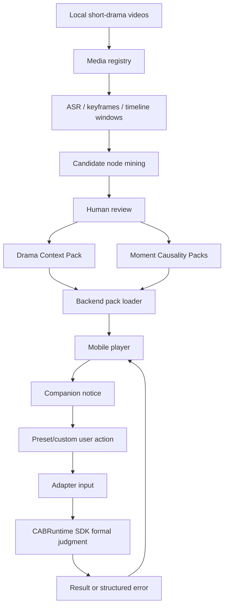

# Competition Technical Document Skeleton v0.1

> Product: Deadman / `要是我来`  
> Target: Byte AI full-stack short-drama challenge  
> Status: Feishu-ready skeleton; content can be filled later  
> Date: 2026-05-25

## 1. Project Summary

`要是我来` is a mobile-first short-drama interaction layer. At selected
high-emotion moments, a companion prompts the viewer to choose or type what they
would do. The backend evaluates the local consequence using scene-level causality
packs and returns a believable result while preserving the original watch flow.

P0 delivery:

```text
mobile-first Web frontend + FastAPI backend
```

## 2. Problem and User Need

Short-drama viewers often think:

- "要是我在这肯定不这么干。"
- "这一步我会反击。"
- "主角不该忍，我来选。"

The product turns that impulse into a moment-level judgment:

```text
If I act this way in this scene, what would plausibly happen?
```

## 3. Module Analysis

| Module | Role | P0 Status |
| --- | --- | --- |
| Viewer frontend | catalog, vertical player, companion, interaction bubble, result/error states | implemented shell; needs UX acceptance pass |
| Backend API | loads drama packs, exposes moments, receives user actions, returns result | implemented demo/test boundary |
| Producer bridge | registers media, mines nodes, publishes reviewed packs | CLI/scripts partial |
| Drama Context Pack | thin global context for a drama | Huangnian exists |
| Moment Causality Pack | typed moment-level fields for judgment | v0.3 draft/schema exists |
| CABRuntime SDK integration | formal runtime/model execution boundary | pending contract / SDK |
| Visual result layer | preset slots and fallback image/text behavior | schemas prepared, provider not connected |

## 4. Core Technical Choices

| Area | Choice | Reason |
| --- | --- | --- |
| Frontend | React + Vite, mobile-first H5/PWA shape | fastest solo-track delivery, easy demo recording |
| Backend | FastAPI | simple local/dev deployment and clear API boundary |
| Runtime data | JSON packs under `data/dramas` | inspectable, versionable, good for P0 |
| Source processing | ARS scripts + human review | proves bridge process without overpromising automation |
| Judgment fields | Moment Field Minimum Set v0.3 | cross-drama minimum fields, not ArcForge-scale world sim |
| Runtime execution | CABRuntime SDK contract | avoid duplicate runtime implementation |
| Image generation | deferred provider spike | realtime speed/quality not yet proven |

## 5. Main Flowchart



## 6. User-Side Demo Script

1. Open drama catalog.
2. Enter `荒年全村啃树皮，我有系统满仓肉`.
3. Play a demo episode.
4. Companion idles half-hidden.
5. At the selected timestamp, companion shows `!`.
6. User taps companion.
7. "要是我来" bubble opens.
8. User selects a preset action.
9. Result shows verdict, consequence, evidence, visual slot/fallback.
10. User closes bubble and continues watching.
11. User submits a custom action.
12. Result or structured error appears.

## 7. Producer-Side Demo Script

1. Register local MP4 materials without committing media.
2. Run or reuse ARS evidence.
3. Review candidate nodes.
4. Publish selected moments into tracked pack data.
5. Reload player and show those moments driving the frontend.

## 8. Work Breakdown and Schedule

| Work item | Owner | Status | Notes |
| --- | --- | --- | --- |
| Branch split: Deadman vs Runtime bridge | Agent-assisted | done | `Deadman/` canonical; `Runtime/` compatibility host |
| P0 viewer shell | Agent-assisted | partial done | needs UX acceptance pass |
| Huangnian ARS first pass | Agent-assisted | done | 20/20 ASR and candidate mining previously completed |
| P0 bridge publish | Agent-assisted | done | 5 reviewed Huangnian moments |
| Minimum field induction | Agent-assisted | done | three-drama evidence, v0.3 fields |
| Red team | Agent-assisted | done | typed subkeys required and applied |
| Backend adapter mapping | Agent-assisted | done | 5/5 Huangnian moments validate against v0.3 |
| CABRuntime SDK integration contract | Agent-assisted | in progress | formal runtime lives outside Deadman |
| P0 UX hardening | TBD | next | mobile acceptance checklist |
| Producer bridge hardening | TBD | next | CLI/report first, not admin dashboard |
| Migration review: Yunmiao/Lihun | TBD | next | evidence only until reviewed |
| Demo recording | TBD | later | after P0 loop stable |

## 9. AI Participation Disclosure

AI tools were used for:

- product requirement drafting;
- source-material analysis planning;
- ARS script design and implementation;
- transcript/candidate clustering assistance;
- schema drafting;
- red-team case generation;
- frontend/backend code generation and tests;
- documentation generation.

Human review remains required for:

- final product priority;
- scene truth promotion;
- selected demo moments;
- source material legality/contest suitability;
- final submission claims.

## 10. Verification Evidence

Fill before submission:

```text
backend tests:
frontend tests:
runtime bridge tests:
mobile viewport smoke:
secret/media scan:
demo recording path:
```

## 11. Known Limitations

- CABRuntime-backed judgment is env-activated, not the default clean deployment mode.
- Image generation provider is not connected.
- Yunmiao/Lihun are migration evidence, not runtime-promoted demos.
- P0 answers local consequence only; it does not create a continuing alternate
  story branch.
- Generated/fallback visuals are not proof of branch truth.

## 12. Final Deliverables

- GitHub repository.
- Runnable frontend/backend demo.
- Demo recording.
- Feishu technical document based on this skeleton.
- Evidence docs for ARS, field induction, red team, and pack publishing.
