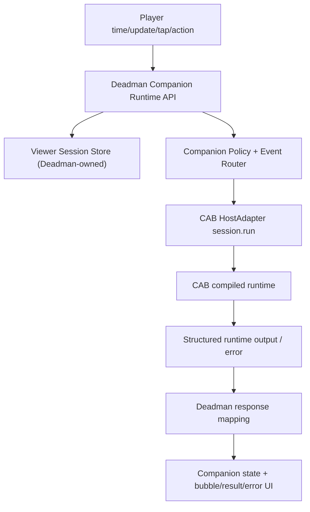

# Deadman Resident Companion Runtime Tech Plan v0.1

> Product: Deadman / 要是我来  
> Scope: user-side resident companion runtime  
> Date: 2026-06-01  
> Status: implementation planning artifact  

## 0. Decision

Deadman should now own the resident companion runtime. For P0/P1, CABRuntime
should be treated as a usable governed runtime substrate, not as the next place
to push viewer-side product work.

CABRuntime currently provides enough for this slice:

- structured final output;
- durable local session/worker surface;
- `cab.host_adapter`;
- fail-closed structured errors;
- explicit persistence signals.

Deadman still needs to define the user-side session, event protocol, companion
policy, UI state, public API shape, and product-safe persistence semantics.

## 1. First-Principles UX

The target UX is not "a judgment API in a bubble." The target UX is:

```text
The viewer feels a watching friend is always present, notices the same tension
beat, lets the viewer say "if it were me," gives a believable friend reaction,
and then lets the viewer keep watching without breaking flow.
```

This creates five hard UX requirements.

| UX requirement | Product consequence | Technical implication |
| --- | --- | --- |
| Continuous presence | The tomato companion should feel resident, not spawned only after submit. | Introduce `viewer_session_id` and a session-scoped runtime API. |
| Low interference | Companion cannot fight subtitles, playback, or emotional beat timing. | Keep notice windows explicit; expire notice outside window unless bubble is open. |
| Context awareness | Companion should know current drama, episode, moment, playback time, and prior local choice. | Send structured player events and maintain host-owned session state. |
| Friend-recognized judgment | The viewer should feel the companion understood the move and reacted like a watching friend, not a rules engine. | Keep local-causality constraints in the runtime, then translate the result through the friend voice layer. |
| Smooth return to watch flow | User should feel comfortable continuing the video, without being told their choice "doesn't affect the plot." | Result generation may use canon/watch-flow material internally, but the UI should surface it as one natural companion response plus a neutral continue action. |

Framing note: local causal consistency is an internal KPI. It prevents the
companion from saying things that do not fit the moment; it is not a viewer-
facing promise that "the world really changed." The public promise is that the
friend recognizes the viewer's impulse and responds believably.

## 2. Current State

Implemented today:

- React player and tomato companion state machine.
- Pack-driven highlight markers and interaction windows.
- `POST /api/deadman/judgment` for preset/custom actions.
- CABRuntime-backed formal judgment path behind `DEADMAN_JUDGMENT_ENGINE=cab_runtime`.
- Fail-closed API error state in the viewer.
- Headless companion runtime endpoint at
  `POST /api/deadman/runtime/session/event`.
- Deadman-owned `FriendVoiceComposer` that turns judgment material into
  `result_surface.single_narrative`.
- Minimal frontend runtime client and player wiring for session start, notice,
  tap, user action, continue, and retry events.

Remaining limitation:

- Runtime state is still in-memory and single-process for P0.
- UI uses the existing bubble and only minimal wiring; no formal visual redesign
  has been done.
- Production multi-user runtime, streaming, voice, and persistent accounts stay
  in P1.

## 3. Required Architecture

P0 resident runtime should be a Deadman host layer around CABRuntime:



Ownership split:

| Layer | Owner | Notes |
| --- | --- | --- |
| Viewer session id, playback event history, product memory | Deadman | CAB must not own real user session. |
| Companion state and interruption policy | Deadman | Product tone and pacing live here. |
| Moment Pack lookup and adapter input mapping | Deadman | Existing `adapter_mapping.py` remains the source. |
| Model/provider loop, structured output, worker/session safety | CABRuntime | Consume through `cab.host_adapter`. |
| Public viewer response shape | Deadman | Must stay mobile/product-friendly. |

## 4. Event Contract

Add a new event-based API instead of overloading `/judgment`.

Recommended endpoint:

```text
POST /api/deadman/runtime/session/event
```

Minimum input schema:

```json
{
  "viewer_session_id": "demo-device-session",
  "event_id": "uuid-or-client-event-id",
  "event_type": "player_tick",
  "drama_id": "huangnian",
  "episode_id": "huangnian_ep12",
  "playback_time_seconds": 12.4,
  "moment_id": "huangnian_ep12_m001",
  "companion_state": "idle",
  "action": null,
  "viewer_profile": {
    "tone": "friend",
    "risk_preference": "balanced"
  }
}
```

P0 event types:

| Event type | Trigger | CAB call? | Purpose |
| --- | --- | --- | --- |
| `session_start` | player opens | no by default | create/restore viewer session. |
| `player_tick` | periodic or marker check | no by default | update time and detect current moment. |
| `moment_notice` | enters interaction window | optional no | return notice/invite policy. |
| `companion_tap` | user taps companion | optional no | open bubble with options. |
| `user_action` | preset/custom submit | yes | produce judgment result. |
| `continue_watching` | close bubble | no | persist light summary and return idle. |
| `runtime_retry` | retry after formal failure | yes if retryable failed action exists | repeat the stored failed action with same session and event id. |

P0 should not call CAB on every playback tick. That would be expensive and slow.
CAB should be called for `user_action` and later for optional lightweight
companion utterances if needed.

## 5. Output Contract

Add a companion runtime response shape. It can wrap existing judgment output
instead of replacing it.

```json
{
  "viewer_session_id": "demo-device-session",
  "event_id": "same-event-id",
  "status": "ok",
  "companion": {
    "next_state": "notice_exclaim",
    "marker": "!",
    "utterance": "这口肉要不要现在拿出来，得想清楚。",
    "should_interrupt": false
  },
  "moment": {
    "moment_id": "huangnian_ep12_m001",
    "interaction_window_active": true,
    "default_options": []
  },
  "judgment": null,
  "session_memory": {
    "last_choice_summary": "",
    "safe_to_reference": false
  },
  "engine": {
    "mode": "host_policy",
    "cab_session_id": "deadman-viewer-demo-device-session"
  }
}
```

For `user_action`, `judgment` may contain the existing `JudgmentResponse`, but
the viewer surface should not render every judgment field as a fixed stack.
`verdict`, `why_this_happens`, `watch_flow_rationale`, visual plan, and aggregate
stats are a material library for response generation. The runtime mapper should
select zero or one supporting cue when useful and blend it into the natural
language result.

Recommended P0 surface wrapper for `user_action`:

```json
{
  "result_surface": {
    "mode": "single_narrative",
    "text": "这手能成，而且比直接端肉稳。四蛋会先觉得自己被照顾到，家里人也能吃上点真东西；但你把来源压成“野味”，就不会立刻把系统暴露给所有人。",
    "micro_cue": {
      "kind": "aggregate_hint",
      "text": "有52%其他观众也这么想。"
    },
    "continue_label": "继续看"
  }
}
```

Friend-voice anchors for P0:

```text
这手可以，先稳住四蛋，比直接端一大盆肉聪明。
你这招有点狠，但在这场面里确实管用，先拿证据比硬吵强。
别急着全亮牌。你这一步先把人心按住，后面才有余地。
```

`micro_cue` is optional. It may come from aggregate stats, canon/watch-flow,
visual fallback, or a compact evidence reason. It must not become a second
field table.

Public copy suppression rule:

- Do not say the user choice has no effect on the plot.
- Do not explain that the result is "only current scene" in viewer-facing copy.
- Do not use phrases such as `原剧情还能继续`, `不改写主线`, `不影响剧情`,
  `只改变眼前`, or `先别把这步当剧情结论`.
- Keep those limits inside runtime policy and evaluation, not inside the
  companion's visible speech.

Failure shape:

```json
{
  "status": "error",
  "error": {
    "code": "provider_timeout",
    "message": "CAB runtime did not finish in time.",
    "retryable": true
  },
  "companion": {
    "next_state": "error",
    "utterance": "这次我卡住了，刚才那手先收一下。"
  }
}
```

Formal runtime failure must not return deterministic judgment as fallback.

### 5.1 Friend Voice Composition Layer

Add an explicit Deadman-owned composition layer:

```text
JudgmentResponse / runtime error
  -> FriendVoiceComposer
  -> result_surface.single_narrative
```

Recommended implementation file:

```text
backend/friend_voice.py
```

Input:

- `JudgmentResponse` or structured runtime error;
- `Moment Pack` hook, preset action, and typed field summary;
- `viewer_action` and source (`preset|custom`);
- optional session memory summary when `safe_to_reference=true`;
- public copy suppression rules.

Output:

```json
{
  "mode": "single_narrative",
  "text": "这手可以，先稳住四蛋，比直接端一大盆肉聪明。你把来源压成野味，家里人能吃上，系统也不至于立刻暴露。",
  "micro_cue": null,
  "continue_label": "继续看"
}
```

P0 composer strategy:

- use deterministic templates plus short field-aware clauses first;
- do not add a second LLM call in P0 unless the formal runtime already returns a
  safe narrative field;
- if CABRuntime later returns `friend_narrative`, Deadman still runs it through
  copy suppression and length/tone validation before display;
- never expose raw `verdict`, `why_this_happens`, `canon_baseline`, or
  `watch_flow_rationale` as separate viewer rows.

Ownership decision: CABRuntime provides governed judgment material; Deadman owns
friend voice, tone, banned public copy, and the final viewer response.

### 5.2 Micro-Cue Selection Rules

P0 must use a deterministic one-cue selector before any LLM delegation.

Selection order:

1. If the result is an error, no `micro_cue`.
2. If the action source is `custom`, default no `micro_cue` unless the runtime
   marks `requires_safety_or_cost_hint=true`.
3. If `aggregate_hint` is available for a preset and does not repeat the result
   text, use one short aggregate cue.
4. If the moment has high `critical_stakes_state`, prefer one compact cost/risk
   cue over aggregate.
5. If the moment is evidence/proof-driven, use one compact evidence cue.
6. Do not use canon/watch-flow rationale as public micro-copy unless it can be
   phrased without plot-impact disclaimer language.
7. Never show more than one cue.

Allowed cue kinds:

```text
aggregate_hint | cost_hint | evidence_hint | visual_fallback_hint
```

`visual_fallback_hint` may explain that no image is shown, but must not imply
that a generated image proves the outcome.

## 6. Session Model

Deadman should keep a small host-owned session state. P0 can be in-memory with
optional JSON persistence for local demo, but the shape must be explicit.

```json
{
  "viewer_session_id": "demo-device-session",
  "created_at": "iso8601",
  "updated_at": "iso8601",
  "drama_id": "huangnian",
  "episode_id": "huangnian_ep12",
  "current_moment_id": "huangnian_ep12_m001",
  "companion_state": "idle",
  "last_action": {
    "moment_id": "huangnian_ep12_m001",
    "text": "今晚分兔肉，先让四蛋确认自己也有份",
    "source": "preset",
    "summary_for_next_moment": "你上一手是先稳住家里人的信任。"
  },
  "cab_session_id": "deadman-viewer-demo-device-session"
}
```

Memory rule:

- Store only compact product memory, not full prompt or raw trace.
- Referencing prior choice is optional and must be one line.
- Never claim that prior choice changed later canon, but also do not tell the
  viewer that it did not change canon.
- CAB's `host_should_persist=false` means do not promote that turn into session
  memory.

Memory derivation rule:

- `summary_for_next_moment` is produced by `FriendVoiceComposer`, not by raw CAB
  trace inspection.
- P0 summary format is one short sentence about the viewer's local move, for
  example `你上一手是先稳住家里人的信任。`
- `safe_to_reference=true` only when all conditions hold:
  - runtime status is `ok`;
  - CAB returned `host_should_persist=true` or the deterministic demo path is
    explicitly marked persistable;
  - copy suppression passes;
  - the summary does not claim later canon changed.
- If any condition fails, store no summary and set `safe_to_reference=false`.

## 7. CAB Integration Change

Current one-shot behavior:

```text
request_id -> deadman-{request_id} CAB session id
```

Required resident behavior:

```text
viewer_session_id -> stable CAB session id
```

Recommended backend change:

```python
class CabRuntimeWorkerClient:
    def judge(
        self,
        adapter_input: dict,
        *,
        viewer_session_id: str,
        event_id: str,
        host_state: dict,
    ) -> CabRuntimeResult:
        ...
```

The actual CAB `message` should remain structured JSON:

```json
{
  "event_type": "user_action",
  "adapter_input": {},
  "session_context": {
    "viewer_session_id": "demo-device-session",
    "previous_choice_summary": "..."
  }
}
```

Product consequence: the model can answer as a continuing companion without
Deadman pretending that CAB owns the product session.

## 8. Companion State Policy

Frontend state machine is mostly usable. Add backend-informed events rather than
replacing it.

Existing states:

```text
idle -> notice_question / notice_exclaim -> stand_bubble
stand_bubble -> thinking -> verdict / error -> dismissed -> idle
```

Needed additions or clarifications:

| State area | P0 rule |
| --- | --- |
| `idle` | Half-hidden. Backend may return no-op. |
| `notice_*` | Only inside active window unless already opened. |
| `stand_bubble` | Options come from `Moment Pack.preset_actions`; not from free LLM generation. |
| `thinking` | Disable duplicate submit; show short friend-like copy. |
| `verdict` | Render one integrated companion narrative. Do not show fixed verdict/why/canon/aggregate rows. |
| `error` | Retry must call same runtime event, not deterministic fallback. |
| `dismissed` | Send `continue_watching`; session memory may update only if CAB allowed persistence. |

Do not make the companion a generic chat agent in P0.

### 8.1 Companion Policy Rules

P0 backend policy must be explicit and deterministic:

1. `should_interrupt=false` by default; notice is visible but does not pause or
   cover the drama until the viewer taps.
2. A notice may appear only inside `interaction_window` and only once per
   moment per viewer session. The backend owns this throttling; frontend
   throttling is only a UI optimization. A new `session_start` begins a fresh
   playback run and clears the per-session notice set.
3. `companion_tap` opens the bubble only for the active moment and reads
   `Moment Pack.preset_actions` for default options.
4. If playback leaves the interaction window before tap, return `idle/no-op`;
   do not open stale bubbles.
5. While `thinking`, duplicate `user_action` events for the same `event_id` are
   idempotent; new submissions are rejected until the current one resolves.
6. After `continue_watching`, cool down the same moment notice for the rest of
   the episode session.
7. Companion copy must stay friend-like: short, direct, emotionally responsive,
   no script-analysis framing and no plot-impact disclaimer.

## 9. Frontend Implementation Plan

Add a thin runtime API client:

```text
frontend/src/api/deadmanRuntimeApi.ts
```

Responsibilities:

- create or read `viewer_session_id` from `sessionStorage`;
- send `session_start`, `moment_notice`, `companion_tap`, `user_action`,
  `continue_watching`;
- store the last retryable `user_action` event payload so retry can resend the
  same `event_id` and action context;
- keep existing `/judgment` path only as fallback demo or legacy test path;
- map runtime response to existing companion machine events.

Modify `Branch3PlayerDemo.tsx`:

- initialize viewer session on mount;
- send `moment_notice` when entering interaction window;
- send `companion_tap` before opening bubble if backend policy is enabled;
- replace direct `createJudgment(...)` with runtime `user_action`;
- replace the current stacked `ResultPanel` with a narrative result panel;
- preserve `ErrorPanel` because formal failure should stay explicit;
- surface `last_choice_summary` in the hook/bubble only when response marks it
  `safe_to_reference=true`.

Do not redesign the UI in this slice.

## 10. Backend Implementation Plan

Recommended new files:

```text
backend/runtime_models.py
backend/viewer_session.py
backend/companion_runtime.py
backend/tests/test_companion_runtime_api.py
```

Responsibilities:

| File | Responsibility |
| --- | --- |
| `runtime_models.py` | Pydantic request/response models for companion events. |
| `viewer_session.py` | Session id validation, in-memory store, memory patch rules. |
| `companion_runtime.py` | Event router, companion policy, CAB judgment call on `user_action`. |
| `api.py` | Mount new runtime endpoint; keep old `/judgment` stable. |

Event routing:

- `session_start`: create session and return `idle`.
- `player_tick`: update playback position, no CAB call.
- `moment_notice`: validate moment/window and return notice marker/hook.
- `companion_tap`: return `stand_bubble` with options from
  `Moment Pack.preset_actions`.
- `user_action`: build adapter input, call CAB if formal engine enabled, map to
  existing `JudgmentResponse`, run `FriendVoiceComposer`, update session memory
  if safe.
- `continue_watching`: mark bubble dismissed; do not call CAB.

P0 storage:

- In-memory store is acceptable for demo.
- P0 assumes a single Uvicorn worker / single process. Multi-worker shared
  session storage is P1.
- If process restarts, viewer session can restart cleanly.
- Do not use CAB session inspect as Deadman product memory source in P0.

## 11. Error And Degradation Policy

| Failure | User-visible behavior | Persistence |
| --- | --- | --- |
| invalid event payload | structured 422 error | no session memory update |
| unknown session | auto-create lightweight viewer session for valid ids | demo-safe recovery from `session_start` race |
| moment not found | short error; allow close | no memory update |
| outside interaction window | return idle/no-op unless bubble already open | no CAB call |
| CAB unavailable | companion error state with retry/continue | no deterministic fallback |
| CAB `host_should_persist=false` | show error or non-persistent result according to status | no memory update |
| output schema invalid | structured error | no memory update |

Retry contract:

- The frontend sends `runtime_retry` with the same `event_id` after a retryable
  runtime failure.
- Backend user-action idempotency is scoped to `viewer_session_id + event_id`
  for repeated `user_action` submissions.
- `runtime_retry` is not a general replay API. If the prior attempt already
  completed successfully, retry returns `runtime_retry_not_available` instead
  of returning a cached success or running CAB twice.
- If no retryable event is stored, `runtime_retry` returns structured error.

## 12. Validation Plan

Backend tests:

- `session_start` creates a session and returns `idle`.
- `moment_notice` inside a window returns correct marker/hook.
- `moment_notice` outside a window returns no interrupt.
- `companion_tap` returns options for the active moment.
- `user_action` returns existing judgment response inside runtime wrapper plus a
  `single_narrative` result surface.
- `FriendVoiceComposer` produces `single_narrative` and applies banned-copy
  suppression.
- `micro_cue` selector returns at most one cue and defaults to no cue for custom
  actions.
- CAB runtime failure returns structured error with no deterministic fallback.
- `host_should_persist=false` prevents session memory update.
- duplicate `moment_notice` for the same moment is throttled by backend session
  state.
- duplicate `user_action` with the same event id returns the cached success.
- `runtime_retry` replays only a stored retryable failure and is unavailable
  after success.
- `continue_watching` returns idle and preserves compact prior summary only when
  allowed.

Frontend tests:

- player creates a session on mount;
- entering a marker window sends notice and shows companion notice;
- tapping companion opens bubble;
- preset action calls runtime endpoint and renders one integrated result;
- custom action calls runtime endpoint and renders one integrated result/error;
- result UI does not render verdict, reason, canon anchor, aggregate, and image
  fallback as a mandatory fixed stack;
- retry uses same event context;
- close returns to video;
- no overflow at `390x844`, `393x852`, `430x932`.

Manual/Playwright smoke:

- one complete preset flow;
- one complete custom or structured error flow;
- second moment can reference previous choice in one safe sentence;
- formal failure shows error state, not fake judgment;
- video playback controls remain usable.

## 13. P0 / P1 Boundary

P0:

- product-resident companion via `viewer_session_id`;
- event-based runtime endpoint;
- stable CAB session id per viewer session;
- host-owned compact memory;
- existing UI, no redesign;
- no deterministic fallback on formal failure.

P1:

- streaming text;
- voice input/output;
- long-running daemon or worker pool;
- free companion chat;
- real persistent user accounts;
- real aggregate stats;
- image generation provider;
- multi-drama runtime promotion.

## 14. Overall Review

No internal contradiction found if the following constraints are respected:

1. CAB remains runtime substrate, not product session owner.
2. Deadman owns viewer session and companion state.
3. `/judgment` can remain for compatibility, but new work should go through the
   companion runtime endpoint.
4. CAB is called only for events that need model judgment, not every playback
   tick.
5. Session memory is compact and product-safe; it does not claim alternate
   canon continuity, and visible copy does not disclaim plot impact.
6. Formal runtime failure is visible as error, never hidden behind deterministic
   demo output.
7. Judgment fields are generation materials, not a viewer-facing field table.
8. P0 resident means user-perceived continuity, not daemon/streaming/multi-user
   production infrastructure.

Expected UX if implemented:

```text
The tomato companion feels present across the viewing session, reacts at
published high-tension moments, remembers the viewer's last local move enough to
sound continuous, but still protects the original drama watching flow.
```

That matches the first-principles UX for P0.
